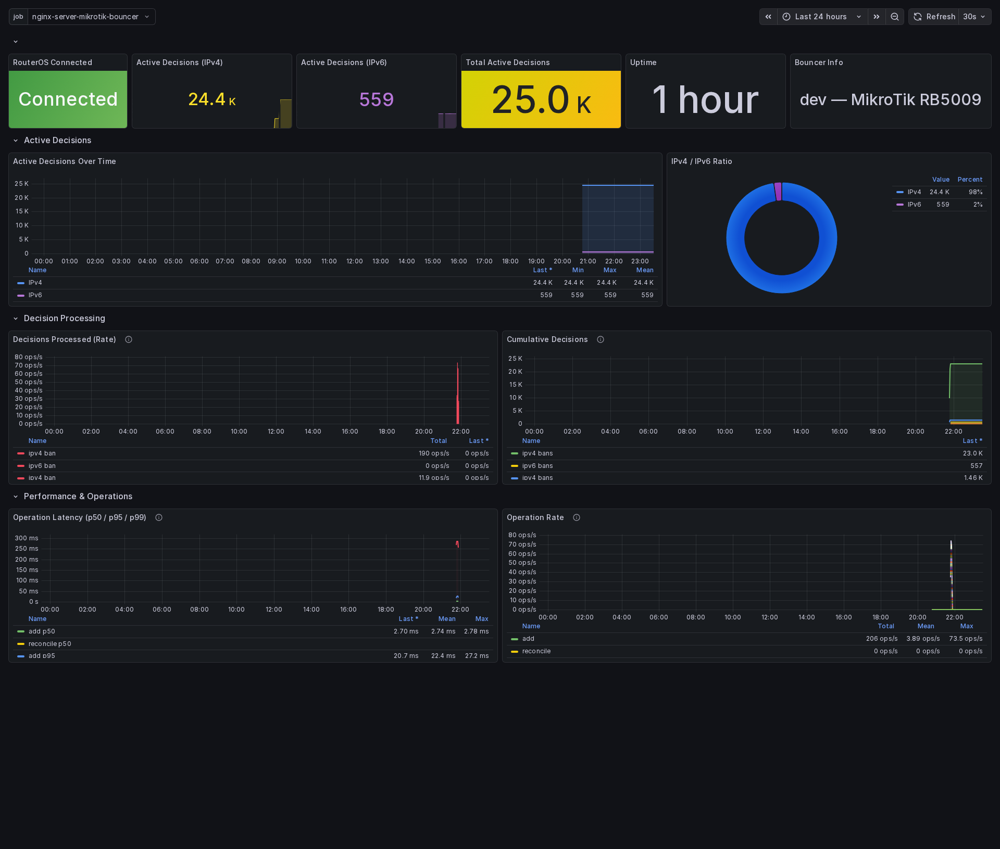

# cs-routeros-bouncer

[](https://github.com/jmrplens/cs-routeros-bouncer/actions/workflows/ci.yml)
[](https://goreportcard.com/report/github.com/jmrplens/cs-routeros-bouncer)
[](https://opensource.org/licenses/MIT)
[](https://go.dev/)

A [CrowdSec](https://www.crowdsec.net/) remediation component (bouncer) for [MikroTik RouterOS](https://mikrotik.com/software) that automatically manages firewall rules and address lists via the RouterOS API.

## Highlights

- **Zero manual router configuration** — auto-creates and auto-removes firewall filter/raw rules on start/stop
- **Individual IP management** — adds on ban, removes on unban (no bulk re-upload, no duplicates)
- **State reconciliation** — on start/restart, syncs CrowdSec decisions with MikroTik state (adds missing, removes stale)
- **Graceful shutdown** — removes firewall rules on stop (address list entries expire via MikroTik timeout)
- **IPv4 + IPv6** — independently toggleable
- **Input + Output blocking** — output blocking optional with configurable interface/interface-list
- **Decision filtering** — sync only local decisions or include CrowdSec community blocklists (CAPI)
- **Observable** — Prometheus metrics (`/metrics`), structured logging, health endpoint (`/health`)
- **Multiple deployment options** — Docker, systemd, or standalone binary

## Why Another Bouncer?

Existing MikroTik bouncers have significant limitations that this project addresses:

| Feature | funkolab (archived) | nvtkaszpir-alt | **cs-routeros-bouncer** |
|---------|:---:|:---:|:---:|
| Auto-create firewall rules | ❌ | ❌ | ✅ |
| Individual IP add/remove | ✅ | ❌ (bulk re-upload) | ✅ |
| No duplicate IPs | ✅ | ❌ | ✅ |
| State reconciliation on restart | ❌ | ❌ | ✅ |
| Remove rules on shutdown | ❌ | ❌ | ✅ |
| IPv6 support | ✅ | ✅ | ✅ |
| Output blocking | ❌ | ✅ | ✅ |
| Origin filtering (local-only mode) | ❌ | ❌ | ✅ |
| Prometheus metrics | ❌ | ✅ | ✅ |
| Health endpoint | ❌ | ❌ | ✅ |
| Go (compiled, low resource usage) | ❌ (Python) | ❌ (Python) | ✅ |

## Requirements

- **CrowdSec** 1.5+ with LAPI accessible from the bouncer host
- **MikroTik RouterOS** 7.x with API enabled (port 8728 or 8729 for TLS)
- A dedicated RouterOS API user (see [Router Setup](#1-register-the-bouncer-with-crowdsec))

## Quick Start

### 1. Register the bouncer with CrowdSec

```bash
sudo cscli bouncers add cs-routeros-bouncer
```

Save the API key shown in the output.

### 2. Create a RouterOS API user

Connect to your MikroTik router and create a dedicated user:

```routeros
/user group add name=crowdsec policy=read,write,api,sensitive,!ftp,!local,!ssh,!reboot,!policy,!test,!password,!sniff,!romon,!rest-api
/user add name=crowdsec group=crowdsec password=YOUR_SECURE_PASSWORD
```

### 3. Install and configure

Choose your preferred installation method below.

---

## Installation

### Docker Compose (recommended)

```yaml
services:
  cs-routeros-bouncer:
    image: ghcr.io/jmrplens/cs-routeros-bouncer:latest
    container_name: cs-routeros-bouncer
    restart: unless-stopped
    ports:
      - "2112:2112"  # Prometheus metrics (optional)
    environment:
      CROWDSEC_URL: "http://crowdsec:8080/"
      CROWDSEC_BOUNCER_API_KEY: "your-bouncer-api-key"
      MIKROTIK_HOST: "192.168.0.1:8728"
      MIKROTIK_USER: "crowdsec"
      MIKROTIK_PASS: "your-password"
    # Or mount a config file:
    # volumes:
    #   - ./config.yaml:/etc/cs-routeros-bouncer/config.yaml
```

```bash
docker compose up -d
```

### Binary + systemd

Download the latest release from the [Releases page](https://github.com/jmrplens/cs-routeros-bouncer/releases):

**Automatic setup (recommended):**

```bash
# Download (replace with your architecture: amd64, arm64, armv7)
wget https://github.com/jmrplens/cs-routeros-bouncer/releases/latest/download/cs-routeros-bouncer_linux_amd64.tar.gz
tar xzf cs-routeros-bouncer_linux_amd64.tar.gz

# Automated install: copies binary, creates config, installs and starts systemd service
sudo ./cs-routeros-bouncer setup

# Edit configuration with your CrowdSec API key and MikroTik credentials
sudo nano /etc/cs-routeros-bouncer/cs-routeros-bouncer.yaml

# Restart after editing config
sudo systemctl restart cs-routeros-bouncer
```

The `setup` subcommand accepts optional flags:

| Flag | Default | Description |
|------|---------|-------------|
| `-bin` | `/usr/local/bin/cs-routeros-bouncer` | Installation path for the binary |
| `-config-dir` | `/etc/cs-routeros-bouncer` | Directory for configuration files |

To uninstall:

```bash
sudo cs-routeros-bouncer uninstall        # Keeps config files
sudo cs-routeros-bouncer uninstall -purge  # Also removes config
```

<details>
<summary><strong>Manual setup</strong></summary>

```bash
# Download
wget https://github.com/jmrplens/cs-routeros-bouncer/releases/latest/download/cs-routeros-bouncer_linux_amd64.tar.gz
tar xzf cs-routeros-bouncer_linux_amd64.tar.gz

# Install
sudo install -m 755 cs-routeros-bouncer /usr/local/bin/
sudo mkdir -p /etc/cs-routeros-bouncer
sudo cp cs-routeros-bouncer.yaml /etc/cs-routeros-bouncer/cs-routeros-bouncer.yaml

# Edit configuration
sudo nano /etc/cs-routeros-bouncer/cs-routeros-bouncer.yaml

# Install systemd service
sudo tee /etc/systemd/system/cs-routeros-bouncer.service > /dev/null << 'EOF'
[Unit]
Description=CrowdSec RouterOS Bouncer
After=network-online.target crowdsec.service
Wants=network-online.target

[Service]
Type=simple
ExecStart=/usr/local/bin/cs-routeros-bouncer -c /etc/cs-routeros-bouncer/cs-routeros-bouncer.yaml
Restart=on-failure
RestartSec=10

[Install]
WantedBy=multi-user.target
EOF

sudo systemctl daemon-reload
sudo systemctl enable --now cs-routeros-bouncer
```

</details>

### Build from source

```bash
git clone https://github.com/jmrplens/cs-routeros-bouncer.git
cd cs-routeros-bouncer
make build

# Option 1: Automated install
sudo bin/cs-routeros-bouncer setup

# Option 2: Manual install
sudo install -m 755 bin/cs-routeros-bouncer /usr/local/bin/
```

---

## Configuration

All options can be set via YAML config file or environment variables. Environment variables override config file values.

See [`config/cs-routeros-bouncer.yaml`](config/cs-routeros-bouncer.yaml) for the full annotated reference.

### Key Options

| Config Key | Env Variable | Default | Description |
|---|---|---|---|
| **CrowdSec** | | | |
| `crowdsec.api_url` | `CROWDSEC_URL` | `http://localhost:8080/` | CrowdSec LAPI URL |
| `crowdsec.api_key` | `CROWDSEC_BOUNCER_API_KEY` | | Bouncer API key |
| `crowdsec.update_frequency` | `CROWDSEC_UPDATE_FREQUENCY` | `10s` | Poll interval for decision updates |
| `crowdsec.origins` | `CROWDSEC_ORIGINS` | `[]` (all) | Filter by origin (`crowdsec cscli` = local only) |
| `crowdsec.scopes` | `CROWDSEC_SCOPES` | `["ip","range"]` | Decision scopes to process |
| `crowdsec.supported_decisions_types` | `CROWDSEC_DECISIONS_TYPES` | `["ban"]` | Decision types to process |
| `crowdsec.scenarios_containing` | `CROWDSEC_SCENARIOS_CONTAINING` | `[]` | Only process matching scenarios |
| `crowdsec.scenarios_not_containing` | `CROWDSEC_SCENARIOS_NOT_CONTAINING` | `[]` | Exclude matching scenarios |
| `crowdsec.insecure_skip_verify` | `CROWDSEC_INSECURE_SKIP_VERIFY` | `false` | Skip TLS certificate verification for LAPI |
| `crowdsec.retry_initial_connect` | `CROWDSEC_RETRY_INITIAL_CONNECT` | `true` | Retry LAPI connection on startup failure |
| `crowdsec.cert_path` | `CROWDSEC_CERT_PATH` | | TLS client certificate path |
| `crowdsec.key_path` | `CROWDSEC_KEY_PATH` | | TLS client key path |
| `crowdsec.ca_cert_path` | `CROWDSEC_CA_CERT_PATH` | | TLS CA certificate path |
| **MikroTik** | | | |
| `mikrotik.address` | `MIKROTIK_HOST` | `192.168.0.1:8728` | RouterOS API address (host:port) |
| `mikrotik.username` | `MIKROTIK_USER` | `crowdsec` | API username |
| `mikrotik.password` | `MIKROTIK_PASS` | | API password |
| `mikrotik.tls` | `MIKROTIK_TLS` | `false` | Use TLS (port 8729) |
| `mikrotik.tls_insecure` | `MIKROTIK_TLS_INSECURE` | `false` | Skip TLS certificate verification for RouterOS |
| `mikrotik.connection_timeout` | `MIKROTIK_CONN_TIMEOUT` | `10s` | Connection timeout |
| `mikrotik.command_timeout` | `MIKROTIK_CMD_TIMEOUT` | `30s` | Command execution timeout |
| **Firewall** | | | |
| `firewall.ipv4.enabled` | `FIREWALL_IPV4_ENABLED` | `true` | Enable IPv4 blocking |
| `firewall.ipv4.address_list` | `FIREWALL_IPV4_ADDRESS_LIST` | `crowdsec-banned` | IPv4 address list name in MikroTik |
| `firewall.ipv6.enabled` | `FIREWALL_IPV6_ENABLED` | `true` | Enable IPv6 blocking |
| `firewall.ipv6.address_list` | `FIREWALL_IPV6_ADDRESS_LIST` | `crowdsec6-banned` | IPv6 address list name in MikroTik |
| `firewall.filter.enabled` | `FIREWALL_FILTER_ENABLED` | `true` | Create filter firewall rules |
| `firewall.filter.chains` | `FIREWALL_FILTER_CHAINS` | `["input"]` | Chains for filter rules |
| `firewall.raw.enabled` | `FIREWALL_RAW_ENABLED` | `true` | Create raw/prerouting rules |
| `firewall.raw.chains` | `FIREWALL_RAW_CHAINS` | `["prerouting"]` | Chains for raw rules |
| `firewall.deny_action` | `FIREWALL_DENY_ACTION` | `drop` | `drop` or `reject` |
| `firewall.rule_placement` | `FIREWALL_RULE_PLACEMENT` | `top` | `top` or `bottom` |
| `firewall.comment_prefix` | `FIREWALL_COMMENT_PREFIX` | `crowdsec-bouncer` | Comment prefix for managed resources |
| `firewall.log` | `FIREWALL_LOG` | `false` | Enable RouterOS logging on firewall rules |
| `firewall.log_prefix` | `FIREWALL_LOG_PREFIX` | `crowdsec-bouncer` | Prefix for RouterOS log entries (when log enabled) |
| `firewall.block_output.enabled` | `FIREWALL_BLOCK_OUTPUT` | `false` | Block outbound traffic to banned IPs |
| `firewall.block_output.interface` | `FIREWALL_OUTPUT_INTERFACE` | | WAN interface for output rules |
| `firewall.block_output.interface_list` | `FIREWALL_OUTPUT_INTERFACE_LIST` | | WAN interface list for output rules |
| **Logging** | | | |
| `logging.level` | `LOG_LEVEL` | `info` | Log level: `debug`, `info`, `warn`, `error` |
| `logging.format` | `LOG_FORMAT` | `text` | Log format: `text` or `json` |
| `logging.file` | `LOG_FILE` | | Log to file (empty = stdout only) |
| **Metrics** | | | |
| `metrics.enabled` | `METRICS_ENABLED` | `false` | Enable Prometheus `/metrics` endpoint |
| `metrics.listen_addr` | `METRICS_ADDR` | `0.0.0.0` | Metrics server listen address |
| `metrics.listen_port` | `METRICS_PORT` | `2112` | Metrics server listen port |

### Configuration Examples

<details>
<summary><b>Minimal — IPv4 only, filter rules</b></summary>

```yaml
crowdsec:
  api_url: "http://localhost:8080/"
  api_key: "your-key"
mikrotik:
  address: "192.168.0.1:8728"
  username: "crowdsec"
  password: "your-password"
firewall:
  ipv6:
    enabled: false
  raw:
    enabled: false
```

</details>

<details>
<summary><b>Full protection — IPv4 + IPv6, filter + raw, input + output</b></summary>

```yaml
crowdsec:
  api_url: "http://localhost:8080/"
  api_key: "your-key"
mikrotik:
  address: "192.168.0.1:8729"
  username: "crowdsec"
  password: "your-password"
  tls: true
firewall:
  ipv4:
    enabled: true
  ipv6:
    enabled: true
  filter:
    enabled: true
    chains: ["input"]
  raw:
    enabled: true
    chains: ["prerouting"]
  deny_action: "drop"
  rule_placement: "top"
  block_output:
    enabled: true
    interface_list: "WAN"
metrics:
  enabled: true
  listen_port: 2112
logging:
  level: "info"
```

</details>

<details>
<summary><b>Local decisions only — no community blocklists</b></summary>

```yaml
crowdsec:
  api_url: "http://localhost:8080/"
  api_key: "your-key"
  origins: ["crowdsec", "cscli"]
mikrotik:
  address: "192.168.0.1:8728"
  username: "crowdsec"
  password: "your-password"
```

</details>

---

## How It Works

### Startup

1. Connects to CrowdSec LAPI and MikroTik RouterOS API
2. Creates firewall rules (filter and/or raw) that reference named address lists
3. Collects all current CrowdSec decisions
4. **Reconciles** with MikroTik address lists — adds missing IPs, removes stale ones

### Runtime

- **Ban**: Adds IP to the MikroTik address list with the CrowdSec ban duration as timeout
- **Unban**: Finds and removes the IP from the address list immediately
- Uses an optimistic-add pattern (~1ms per IP vs ~400ms with lookup-first)

### Shutdown (SIGTERM / SIGINT)

- Removes all bouncer-managed firewall rules from MikroTik
- Address list entries remain and expire naturally via their MikroTik timeout

### Firewall Rules

The bouncer creates rules with descriptive comments for identification:

```
;;; crowdsec-bouncer:filter-input-input-v4
chain=input action=drop src-address-list=crowdsec-banned

;;; crowdsec-bouncer:raw-prerouting-input-v4
chain=prerouting action=drop src-address-list=crowdsec-banned
```

Rules are placed at the **top** of the chain by default (`rule_placement: top`) to ensure they are evaluated first. If a dynamic/builtin rule occupies position 0 (e.g., RouterOS fasttrack counters), the bouncer automatically places the rule at position 1.

### Performance

Tested on a **MikroTik RB5009UG+S+** (ARM64, 4 cores @ 1400MHz, RouterOS 7.21) with the bouncer running on a separate Linux host connected via the RouterOS API (plaintext, port 8728):

| Metric | Value |
|--------|-------|
| Total IPs synced | **25,106** (24,542 IPv4 + 564 IPv6) |
| Initial sync time | **~6 min 45s** (cold start, empty router) |
| Firewall rules created | 4 rules in ~2s |
| Avg throughput | ~62 IPs/second |
| Bouncer memory (steady) | ~30 MB |
| Bouncer CPU (steady) | <1% |

**Individual operation latency** (RouterOS API, 20 trials per count, median):

| IPs | Add (median) | Remove (median) | Per-IP add | Per-IP remove |
|-----|-------------|-----------------|------------|---------------|
| 1   | 2.3 ms      | 2.0 ms          | 2.3 ms     | 2.0 ms        |
| 2   | 5.2 ms      | 4.6 ms          | 2.6 ms     | 2.3 ms        |
| 5   | 45.1 ms     | 12.8 ms         | 9.0 ms     | 2.6 ms        |
| 10  | 13.9 ms     | 10.7 ms         | 1.4 ms     | 1.1 ms        |

> **Note:** Initial sync speed depends on RouterOS API latency and the number of existing entries.
> Individual operations are typically **1–3 ms per IP** (median). Occasional latency spikes
> (p95 up to ~50 ms) are caused by RouterOS internal scheduling on large address lists.

---

## Monitoring

### Health Endpoint

```bash
curl http://localhost:2112/health
# {"status":"ok","routeros_connected":true,"version":"v0.1.0"}
```

### Prometheus Metrics

Enable with `metrics.enabled: true`. Available at `http://localhost:2112/metrics`.

| Metric | Type | Description |
|--------|------|-------------|
| `crowdsec_bouncer_active_decisions` | Gauge | Active decisions by protocol (ipv4/ipv6) |
| `crowdsec_bouncer_decisions_total` | Counter | Total decisions processed (ban/unban) |
| `crowdsec_bouncer_errors_total` | Counter | Total errors by type |
| `crowdsec_bouncer_operation_duration_seconds` | Histogram | Operation latency (add/remove/reconcile) |
| `crowdsec_bouncer_routeros_connected` | Gauge | RouterOS connection status (1/0) |
| `crowdsec_bouncer_info` | Gauge | Build info (version, RouterOS identity) |

### Grafana Dashboard

A ready-to-use Grafana dashboard is included at [`grafana/dashboard.json`](grafana/dashboard.json).

**Import steps:**

1. In Grafana, go to **Dashboards → Import**
2. Upload `grafana/dashboard.json` or paste its contents
3. Select your Prometheus datasource
4. Click **Import**

The dashboard provides real-time visibility into the bouncer's operation:

<p align="center">
  <picture>
    <source media="(prefers-color-scheme: dark)" srcset="docs/images/grafana-dashboard-dark.png">
    <source media="(prefers-color-scheme: light)" srcset="docs/images/grafana-dashboard-light.png">
    
  </picture>
</p>

**Dashboard panels:**

| Panel | Description |
|-------|-------------|
| Bouncer Info | Version, RouterOS identity, uptime |
| Active Decisions | Current banned IPs by protocol (IPv4/IPv6) |
| RouterOS Connection | Connection status over time |
| Decisions Processed | Rate of ban/unban operations |
| Cumulative Decisions | Total decisions processed |
| Errors | Error rate by type (api, routeros, reconcile) |
| Operation Latency | p50/p95/p99 latency for add/remove/reconcile |
| Reconciliation Events | Full sync events timeline |

---

## Troubleshooting

<details>
<summary><b>Cannot connect to RouterOS API</b></summary>

- Verify the API service is enabled: `/ip/service/print` — `api` should be enabled on your router
- Check the router firewall doesn't block port 8728/8729 from the bouncer host
- Verify username/password and that the user has `api` policy
- For TLS: ensure `mikrotik.tls: true` and the correct port (8729)

</details>

<details>
<summary><b>Firewall rules not at the top of the chain</b></summary>

- RouterOS dynamic/builtin rules (e.g., fasttrack counters) cannot be moved — the bouncer places rules at position 1 in this case
- Verify with: `/ip/firewall/filter/print` on the router
- Ensure `firewall.rule_placement: "top"` is set in your config

</details>

<details>
<summary><b>Address list not being populated</b></summary>

- Check CrowdSec has active decisions: `sudo cscli decisions list`
- Verify the API key is correct — check bouncer logs for authentication errors
- Set `logging.level: debug` for detailed decision processing logs
- If using `crowdsec.origins`, ensure it includes the expected sources

</details>

<details>
<summary><b>High memory/CPU usage at startup</b></summary>

- Large community blocklists (CAPI) can contain 20,000+ IPs — initial reconciliation processes them all
- Use `crowdsec.origins: ["crowdsec", "cscli"]` to sync only local decisions
- This is a one-time cost at startup; runtime processing is ~1ms per IP

</details>

---

## Development

See [CONTRIBUTING.md](CONTRIBUTING.md) for development setup and guidelines.

```bash
make build          # Build binary
make test           # Run tests
make lint           # Run linter
make docker-build   # Build Docker image
```

## Security

See [SECURITY.md](SECURITY.md) for the security policy and responsible disclosure process.

## License

[MIT](LICENSE)

## Acknowledgments

- [CrowdSec](https://www.crowdsec.net/) — open-source collaborative security engine
- [go-routeros](https://github.com/go-routeros/routeros) — Go library for the RouterOS API
- [funkolab/cs-mikrotik-bouncer](https://github.com/funkolab/cs-mikrotik-bouncer) — original Python bouncer (archived)
- [nvtkaszpir/cs-mikrotik-bouncer-alt](https://github.com/nvtkaszpir/cs-mikrotik-bouncer-alt) — alternative Python bouncer
