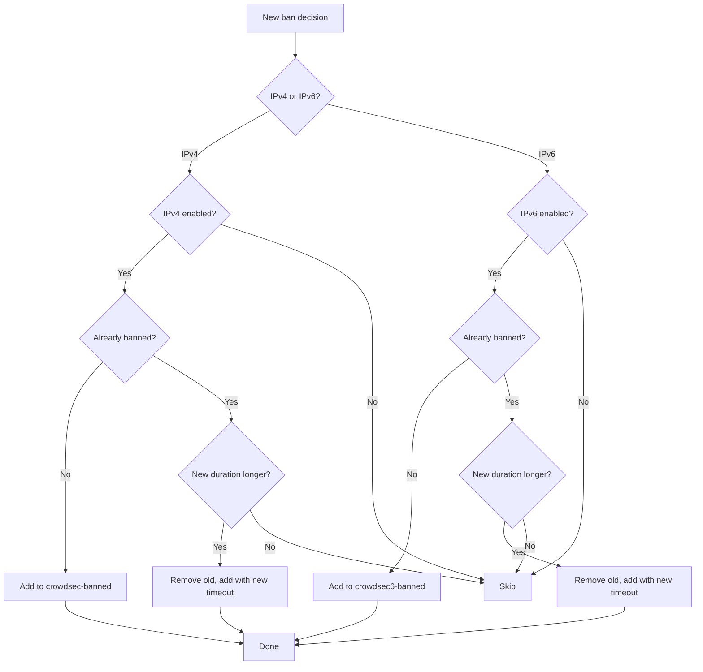

# Decision Processing

How the bouncer processes CrowdSec decisions and translates them into MikroTik actions.

## Decision types

The bouncer processes decisions from CrowdSec LAPI. Each decision has:

| Field | Description |
|-------|-------------|
| **Type** | Action to take (e.g., `ban`) |
| **Value** | IP address or CIDR range |
| **Scope** | `ip` or `range` |
| **Duration** | How long the ban lasts |
| **Origin** | Where the decision came from (`crowdsec`, `cscli`, `CAPI`) |
| **Scenario** | Detection scenario that triggered the decision |

## Processing flow

### Ban (new decision)

When a new ban decision arrives:

1. Determine if it's IPv4 or IPv6
2. Check if the protocol is enabled
3. Add the IP to the appropriate MikroTik address list
4. Set the MikroTik timeout to match the CrowdSec ban duration



### Duplicate IP handling

When a ban decision arrives for an IP that is already in the address list, the bouncer compares durations:

- **New duration is longer**: The existing entry is removed and a new one is created with the longer timeout. For example, if an IP was banned for 24 hours and a new 7-day ban arrives, the entry is replaced with the 7-day timeout.
- **New duration is shorter or equal**: The new decision is silently discarded — the existing, longer ban remains in effect.

This ensures that the most severe ban always takes precedence.

### Unban (deleted decision)

When a decision is deleted (expired or manually removed):

1. Determine if it's IPv4 or IPv6
2. Search for the IP in the MikroTik address list
3. Remove it immediately

!!! note
    Even without explicit unban, address list entries expire via their MikroTik timeout. The unban operation provides immediate removal.

## Origin filtering

The `crowdsec.origins` setting controls which decisions are processed:

| Configuration | Behavior |
|--------------|----------|
| `origins: []` (default) | All decisions (local + community blocklists) |
| `origins: ["crowdsec", "cscli"]` | Only local decisions |
| `origins: ["CAPI"]` | Only community blocklists |

### Why use local-only mode?

Community blocklists (CAPI) can contain 20,000+ IP addresses. Pushing all of these to a MikroTik router:

- Increases memory usage on the router
- Takes longer during initial reconciliation (~2 min 50 s for ~25,000 IPs vs ~9 s for ~1,500 local IPs)
- Increases steady-state router CPU usage (15–20% vs 8–11% for local-only)

For most home and small-business setups, `origins: ["crowdsec", "cscli"]` is recommended.

## Scenario filtering

For fine-grained control, you can filter by scenario name:

```yaml
crowdsec:
  # Only process SSH and HTTP-related scenarios
  scenarios_containing: ["ssh", "http"]

  # Exclude specific scenarios
  scenarios_not_containing: ["false-positive"]
```

## Scope handling

The bouncer supports two scopes:

- `ip` — single IP addresses (e.g., `192.168.1.100`)
- `range` — CIDR ranges (e.g., `192.168.1.0/24`)

Both are added to the MikroTik address list in the same way — RouterOS natively supports CIDR notation in address lists.
