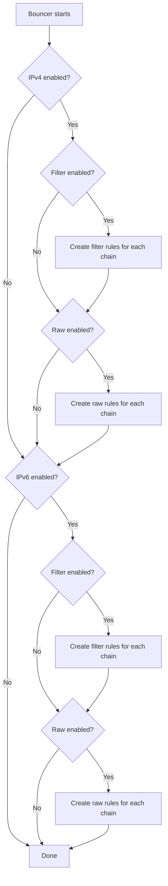

# Firewall Rules

How the bouncer creates and manages firewall rules in MikroTik RouterOS.

## Rule types

The bouncer can create rules in two firewall tables:

### Filter rules (`/ip/firewall/filter`)

Standard firewall rules processed after connection tracking. These are the most common type of firewall rules.

```routeros
;;; crowdsec-bouncer:filter-input-input-v4
chain=input action=drop src-address-list=crowdsec-banned
```

### Raw rules (`/ip/firewall/raw`)

Raw rules are processed before connection tracking, providing earlier packet filtering. This means:

- **Lower CPU usage** — packets are dropped before connection tracking
- **Earlier filtering** — packets don't reach the filter chain
- **Defense in depth** — combined with filter rules for maximum protection

```routeros
;;; crowdsec-bouncer:raw-prerouting-input-v4
chain=prerouting action=drop src-address-list=crowdsec-banned
```

## Rule creation

On startup, the bouncer creates rules based on configuration:



## Rule placement

By default (`rule_placement: top`), rules are placed at position 0 in the chain — ensuring they are evaluated first.

If position 0 is occupied by a dynamic/builtin rule (e.g., RouterOS fasttrack counters that cannot be moved), the bouncer:

1. Creates the rule (appended at the end)
2. Attempts to move it to position 0
3. If move fails, tries position 1, then 2, and so on until it finds a valid position

## Rule identification

Each rule has a structured comment for identification:

```
{prefix}:{table}-{chain}-{direction}-{protocol}
```

| Component | Values |
|-----------|--------|
| `prefix` | Configurable (default: `crowdsec-bouncer`) |
| `table` | `filter` or `raw` |
| `chain` | `input`, `forward`, `prerouting`, `output` |
| `direction` | `input` or `output` |
| `protocol` | `v4` or `v6` |

## Output rules

When `block_output.enabled: true`, additional rules block outgoing traffic to banned IPs:

```routeros
;;; crowdsec-bouncer:filter-input-output-v4
chain=input action=drop dst-address-list=crowdsec-banned out-interface-list=WAN
```

Output rules use `dst-address-list` instead of `src-address-list` and require an interface or interface-list specification.

## Rule cleanup

On graceful shutdown (SIGTERM/SIGINT), the bouncer:

1. Lists all rules matching the comment prefix
2. Deletes them from MikroTik

Address list entries are **not** deleted — they expire naturally via their MikroTik timeout. This provides continued protection even if the bouncer restarts.
