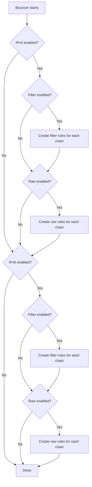

# Firewall Rules

How the bouncer creates and manages firewall rules in MikroTik RouterOS.

## Rule types

The bouncer can create rules in two firewall tables:

### Filter rules (`/ip/firewall/filter`)

Standard firewall rules processed after connection tracking. These are the most common type of firewall rules.

```routeros
;;; crowdsec-bouncer:filter-input-input-v4
chain=input action=drop src-address-list=crowdsec-banned
```

### Raw rules (`/ip/firewall/raw`)

Raw rules are processed before connection tracking, providing earlier packet filtering. This means:

- **Lower CPU usage** — packets are dropped before connection tracking
- **Earlier filtering** — packets don't reach the filter chain
- **Defense in depth** — combined with filter rules for maximum protection

```routeros
;;; crowdsec-bouncer:raw-prerouting-input-v4
chain=prerouting action=drop src-address-list=crowdsec-banned
```

## Rule creation

On startup, the bouncer creates rules based on configuration:



## Rule placement

By default (`rule_placement: top`), rules are placed at position 0 in the chain — ensuring they are evaluated first.

If position 0 is occupied by a dynamic/builtin rule (e.g., RouterOS fasttrack counters that cannot be moved), the bouncer:

1. Creates the rule (appended at the end)
2. Attempts to move it to position 0
3. If move fails, tries position 1, then 2, and so on until it finds a valid position

## Rule identification

Each rule has a structured comment for identification:

```
{prefix}:{table}-{chain}-{direction}-{protocol}
```

| Component | Values |
|-----------|--------|
| `prefix` | Configurable (default: `crowdsec-bouncer`) |
| `table` | `filter` or `raw` |
| `chain` | `input`, `forward`, `prerouting`, `output` |
| `direction` | `input` or `output` |
| `protocol` | `v4` or `v6` |

Examples:

- `crowdsec-bouncer:filter-input-input-v4` — filter table, input chain, input direction, IPv4
- `crowdsec-bouncer:raw-prerouting-input-v6` — raw table, prerouting chain, input direction, IPv6
- `crowdsec-bouncer:filter-output-output-v4` — filter table, output chain, output direction, IPv4

## Output rules

When `block_output.enabled: true`, additional rules block outgoing traffic to banned IPs:

```routeros
;;; crowdsec-bouncer:filter-output-output-v4
chain=output action=drop dst-address-list=crowdsec-banned out-interface-list=WAN
```

Output rules use `dst-address-list` instead of `src-address-list` and require an interface or interface-list specification.

## Rule customization features

The bouncer supports several rule customization options that modify the generated firewall rules:

### Connection-state filter (filter rules only)

When `filter.connection_state` is set, the filter rules only match packets in the specified connection states. This is useful for allowing established/related traffic through while blocking new connections from banned IPs.

```routeros
;;; crowdsec-bouncer:filter-input-input-v4
chain=input action=drop src-address-list=crowdsec-banned connection-state=new
```

!!! note
    Connection-state is only available for filter rules, not raw rules. Raw rules are processed before connection tracking.

### Input whitelist

When `block_input.whitelist` is set, the bouncer creates an accept rule **before** the drop rule. This allows IPs in the whitelist to bypass the ban, even if they appear in the banned address list.

```routeros
;;; crowdsec-bouncer:filter-input-input-v4
chain=input action=accept src-address-list=crowdsec-whitelist in-interface-list=WAN

;;; crowdsec-bouncer:filter-input-input-v4
chain=input action=drop src-address-list=crowdsec-banned in-interface-list=WAN
```

### Output passthrough

For output rules, you can allow a specific local IP or an entire address list to bypass the outgoing ban:

**Using a single IP** (`passthrough_v4` / `passthrough_v6`):

```routeros
;;; crowdsec-bouncer:filter-output-output-v4
chain=output action=drop src-address=!10.0.0.100 dst-address-list=crowdsec-banned
```

**Using an address list** (`passthrough_v4_list` / `passthrough_v6_list`, takes precedence over IP):

```routeros
;;; crowdsec-bouncer:filter-output-output-v4
chain=output action=drop src-address-list=!crowdsec-passthrough dst-address-list=crowdsec-banned
```

The `!` prefix in RouterOS negates the match — the rule applies to all source addresses **except** the specified IP or list.

### Log prefix

When `log: true` is enabled, each rule can have a log prefix for identification in MikroTik logs. The prefix follows a hierarchical resolution:

1. **Per-type prefix** (`filter.log_prefix`, `raw.log_prefix`, `block_output.log_prefix`) — highest priority
2. **Global prefix** (`log_prefix`) — used if no per-type prefix is set
3. **No prefix** — if neither is set

```routeros
;;; crowdsec-bouncer:filter-input-input-v4
chain=input action=drop src-address-list=crowdsec-banned log=yes log-prefix="CS-FILTER"
```

### Reject-with

When `deny_action: reject` is configured, you can specify the ICMP reject type via `reject_with`:

```routeros
;;; crowdsec-bouncer:filter-input-input-v4
chain=input action=reject reject-with=icmp-host-prohibited src-address-list=crowdsec-banned
```

Available `reject_with` values: `icmp-network-unreachable`, `icmp-host-unreachable`, `icmp-port-unreachable`, `icmp-protocol-unreachable`, `icmp-network-prohibited`, `icmp-host-prohibited`, `icmp-admin-prohibited`, `tcp-reset`.

## Rule cleanup

On graceful shutdown (SIGTERM/SIGINT), the bouncer:

1. Lists all rules matching the comment prefix
2. Deletes them from MikroTik

Address list entries are **not** deleted — they expire naturally via their MikroTik timeout. This provides continued protection even if the bouncer restarts.
