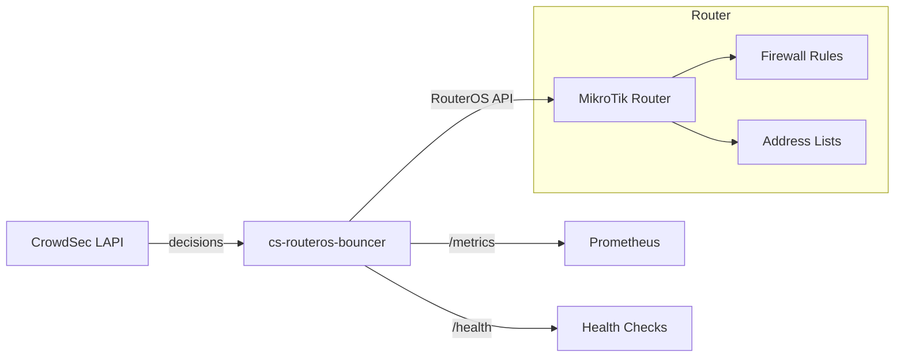
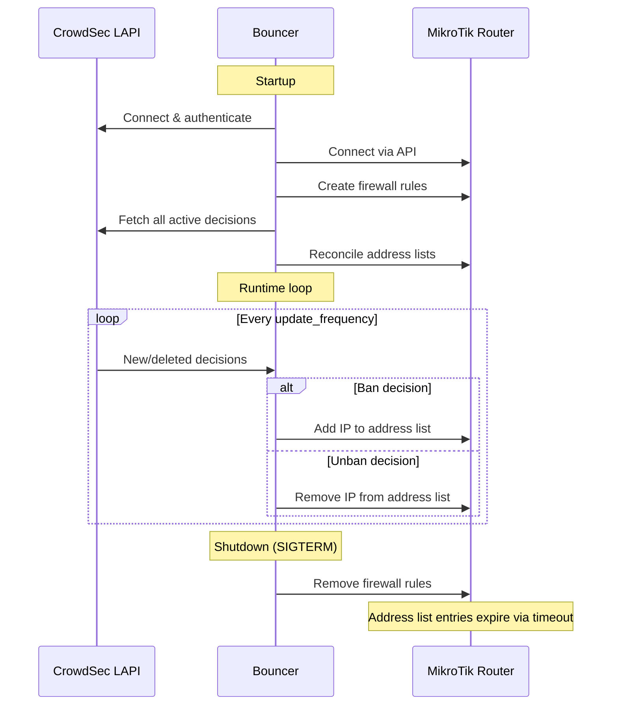

# Architecture

cs-routeros-bouncer acts as a bridge between CrowdSec's threat intelligence and MikroTik's firewall.

## Overview



## Components

The bouncer is composed of several internal packages:

| Package | Responsibility |
|---------|---------------|
| `cmd/cs-routeros-bouncer` | CLI entrypoint, subcommand routing |
| `internal/config` | Configuration loading, validation, environment variable binding |
| `internal/crowdsec` | CrowdSec LAPI streaming client |
| `internal/routeros` | RouterOS API client (addresses, firewall rules) |
| `internal/manager` | Central orchestrator — ties everything together |
| `internal/metrics` | Prometheus metrics and health endpoint |

## Data flow



## Design principles

### Comment-based identification

All resources created by the bouncer in MikroTik are tagged with a structured comment:

```
{comment_prefix}:{type}-{chain}-{direction}-{protocol}
```

Examples:

- `crowdsec-bouncer:filter-input-input-v4`
- `crowdsec-bouncer:raw-prerouting-input-v6`

This allows the bouncer to precisely identify and manage its own resources without affecting user-created rules.

### Optimistic-add pattern

When adding an IP to the address list, the bouncer uses an "optimistic-add" approach:

1. Try to add the IP directly (~1ms)
2. If RouterOS returns "already have such entry", silently succeed

This is significantly faster than the "check-first" approach (~400ms per IP), which would require listing all entries first.

### Single named address lists

Unlike some bouncers that create timestamped lists, cs-routeros-bouncer uses a single named address list per protocol:

- `crowdsec-banned` for IPv4
- `crowdsec6-banned` for IPv6

Firewall rules reference these lists by name, which is more efficient and avoids the duplication problem.

### Diff-based reconciliation

On startup, the bouncer performs a diff between CrowdSec's active decisions and MikroTik's current address list state:

1. Fetch all active decisions from CrowdSec
2. Fetch all entries in the address list from MikroTik
3. Compare the two sets
4. Add missing entries (in CrowdSec but not in MikroTik)
5. Remove stale entries (in MikroTik but not in CrowdSec)

This ensures perfect synchronization regardless of how the bouncer was stopped or what happened while it was offline.
