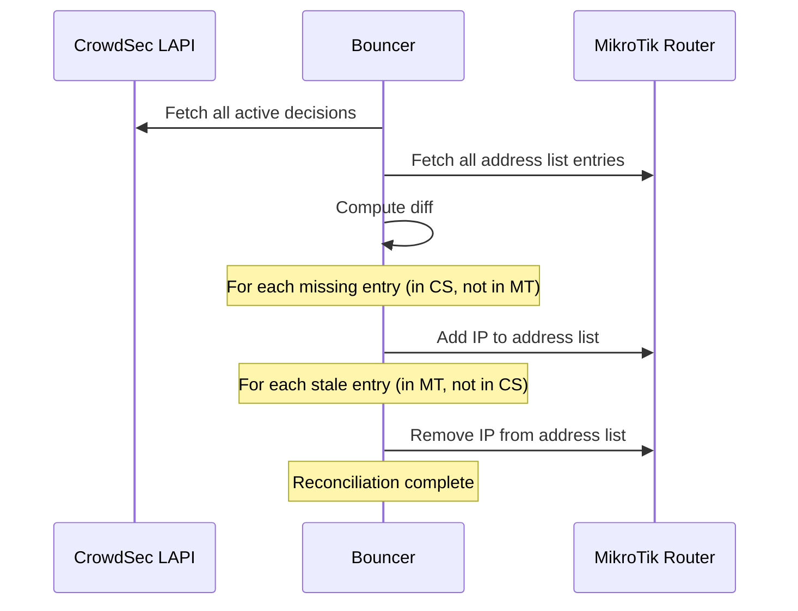

# State Reconciliation

How the bouncer ensures MikroTik's state matches CrowdSec's decisions on startup and restart.

## Why reconciliation?

When the bouncer restarts, the MikroTik router's address lists may be out of sync with CrowdSec's current decisions:

- **New decisions appeared** while the bouncer was offline → need to add to router
- **Decisions expired** while the bouncer was offline → need to remove from router
- **Bouncer crashed** without cleanup → stale entries may exist

Reconciliation ensures a consistent state regardless of how the bouncer stopped or what happened while it was down.

## Reconciliation process

### Step by step

1. **Fetch CrowdSec state**: Get all active decisions from LAPI
2. **Fetch MikroTik state**: Get all entries in the address list(s)
3. **Compute diff**:
    - **To add**: IPs in CrowdSec but not in MikroTik
    - **To remove**: IPs in MikroTik (tagged by the bouncer) but not in CrowdSec
4. **Apply changes**: Add missing, remove stale

## Performance

Reconciliation with large lists:

| IP count | Typical duration |
|----------|-----------------|
| 100 | < 1 second |
| 1,000 | ~2 seconds |
| 10,000 | ~15 seconds |
| 20,000+ | ~30+ seconds |

!!! tip
    If reconciliation is slow, consider using local-only mode (`origins: ["crowdsec", "cscli"]`) to reduce the number of decisions.

## Metrics

Reconciliation events are tracked via Prometheus metrics:

- `crowdsec_bouncer_reconciliation_total` — counter of reconciliation events
- `crowdsec_bouncer_operation_duration_seconds{operation="reconcile"}` — duration histogram

These can be monitored in the [Grafana dashboard](../monitoring/grafana.md).
