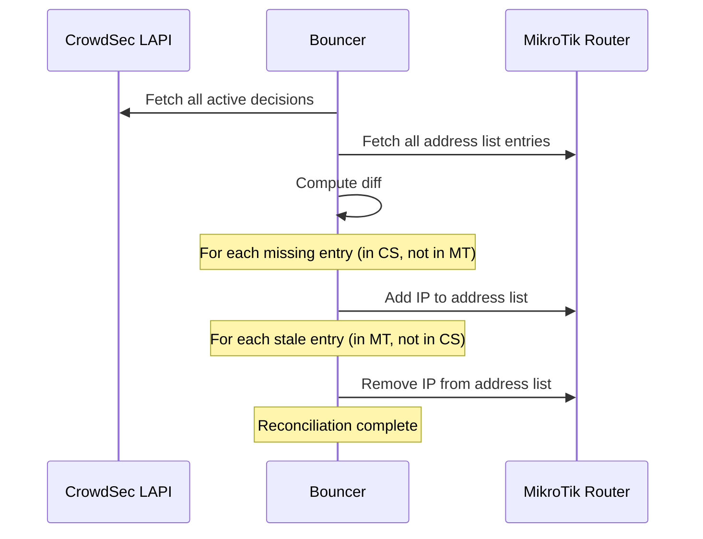

# State Reconciliation

How the bouncer ensures MikroTik's state matches CrowdSec's decisions on startup and restart.

## Why reconciliation?

When the bouncer restarts, the MikroTik router's address lists may be out of sync with CrowdSec's current decisions:

- **New decisions appeared** while the bouncer was offline → need to add to router
- **Decisions expired** while the bouncer was offline → need to remove from router
- **Bouncer crashed** without cleanup → stale entries may exist

Reconciliation ensures a consistent state regardless of how the bouncer stopped or what happened while it was down.

## Reconciliation process

### Step by step

1. **Fetch CrowdSec state**: Get all active decisions from LAPI
2. **Fetch MikroTik state**: Get all entries in the address list(s)
3. **Compute diff**:
    - **To add**: IPs in CrowdSec but not in MikroTik
    - **To remove**: IPs in MikroTik (tagged by the bouncer) but not in CrowdSec
4. **Apply changes**: Add missing, remove stale

## Performance

Reconciliation uses a **connection pool** (4 parallel API connections) and **script-based bulk add** (chunks of 100 entries) to maximize throughput. Benchmarked on a **MikroTik RB5009UG+S+** (ARM64, 4 cores @ 1400 MHz, RouterOS 7.21.3):

### Cold start (empty router)

| IP count | Duration | Throughput | Router CPU peak |
|----------|----------|------------|-----------------|
| ~1,500 (local only) | **~9 s** | ~168 IPs/s | 14% |
| ~25,000 (local + CAPI) | **~2 min 50 s** | ~147 IPs/s | 23% |

### Restart (entries already on router)

| Existing IPs | Duration | Router CPU peak |
|-------------|----------|-----------------|
| ~25,000 | **~10 s** | 16% |

When all IPs are already present, reconciliation only performs a diff — no bulk add or remove operations are needed, completing in seconds.

### Mass removal (e.g., switching from CAPI to local-only)

| Removed | Duration | Throughput | Router CPU peak |
|---------|----------|------------|-----------------|
| ~23,500 | **~3 min 45 s** | ~105 removes/s | 22% |

!!! tip
    If reconciliation is slow, consider using local-only mode (`origins: ["crowdsec", "cscli"]`) to reduce the number of decisions.

## Metrics

Reconciliation events are tracked via Prometheus metrics:

- `crowdsec_bouncer_reconciliation_total` — counter of reconciliation events
- `crowdsec_bouncer_operation_duration_seconds{operation="reconcile"}` — duration histogram

These can be monitored in the [Grafana dashboard](../monitoring/grafana.md).
