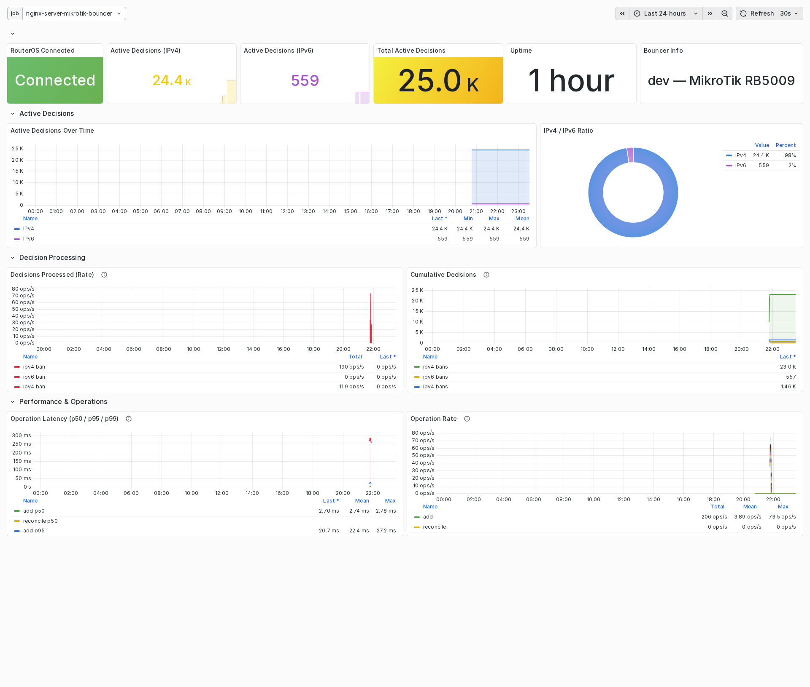

# Grafana Dashboard

A ready-to-use Grafana dashboard is included for monitoring the bouncer.

## Preview

<figure markdown>
  { width="100%" }
  <figcaption>Dashboard in dark theme</figcaption>
</figure>

<figure markdown>
  { width="100%" }
  <figcaption>Dashboard in light theme</figcaption>
</figure>

## Import

The dashboard JSON is located at [`grafana/dashboard.json`](https://github.com/jmrplens/cs-routeros-bouncer/blob/main/grafana/dashboard.json).

### Steps

1. In Grafana, go to **Dashboards → Import**
2. Upload `grafana/dashboard.json` or paste its contents
3. Select your Prometheus datasource when prompted
4. Click **Import**

!!! tip "Datasource variable"
    The dashboard uses `${DS_PROMETHEUS}` as a datasource placeholder. During import, Grafana will ask you to map it to your Prometheus datasource.

## Panels

The dashboard contains **30 panels** organized in **8 rows** with a modern design:

- **Transparent backgrounds** on all panels for a clean, unified look
- **Smooth line interpolation** and subtle area fills on time series
- **Multi-tooltip** mode with sorted values for quick multi-series comparison
- **Table legends** with calculated stats (last, mean, max) on key panels
- **Sparkline mini-graphs** on stat panels showing recent trends
- **Semantic colors** — red for errors/bans, green for unbans/healthy, orange for warnings
- **Threshold visualization** on CPU load (dashed lines at 60% / 85%)
- **Hover descriptions** on every panel explaining the metric and normal ranges

### Overview

| Panel | Type | Description |
|-------|------|-------------|
| **RouterOS Connected** | stat | Connection status indicator |
| **Active Decisions (IPv4)** | stat | Current IPv4 banned IPs |
| **Active Decisions (IPv6)** | stat | Current IPv6 banned IPs |
| **Total Active Decisions** | stat | Combined IPv4 + IPv6 count |
| **Uptime** | stat | Time since bouncer started |
| **Bouncer Info** | stat | Version and RouterOS identity |
| **IPv4 / IPv6 Ratio** | piechart | Proportion of IPv4 vs IPv6 bans |

### RouterOS System

| Panel | Type | Description |
|-------|------|-------------|
| **RouterOS System** | gauge | Combined CPU load (%), CPU temperature (°C), and memory usage (%) with per-metric thresholds |
| **CPU Load Over Time** | timeseries | CPU load history with threshold lines at 60% and 85% |
| **Memory & Temperature Over Time** | timeseries | Memory usage and CPU temperature history (dual axis) |

### Decisions

| Panel | Type | Description |
|-------|------|-------------|
| **Active Decisions Over Time** | timeseries | IPv4 (blue) / IPv6 (purple) decisions over time |
| **Cumulative Decisions** | timeseries | Total decisions since startup |
| **Decisions Processed (Rate)** | timeseries | Ban (red) / unban (green) rate per second (full width) |

### Decisions by Origin

| Panel | Type | Description |
|-------|------|-------------|
| **Active Decisions by Origin** | bargauge | Per-origin decision count (crowdsec, cscli, CAPI) |
| **Decisions by Origin (Rate)** | timeseries | Decision rate per origin |
| **Cumulative Decisions by Origin** | timeseries | Running total per origin |

### Dropped Traffic

| Panel | Type | Description |
|-------|------|-------------|
| **Dropped Bytes** | stat | Total bytes dropped by bouncer rules |
| **Dropped Packets** | stat | Total packets dropped by bouncer rules |
| **Dropped Traffic Rate** | timeseries | Bytes/packets dropped per second |
| **Dropped Traffic (Cumulative)** | timeseries | Running total of dropped traffic |

### Errors & Reconciliation

| Panel | Type | Description |
|-------|------|-------------|
| **Error Rate** | timeseries | Errors per second by category |
| **Total Errors** | stat | Cumulative error count (red background when > 0) |
| **RouterOS Connection** | state-timeline | Connection status history |
| **Last Reconciliation** | stat | Time since last reconciliation |
| **Reconciliation Duration** | stat | Duration of last reconciliation |

### Performance & Operations

| Panel | Type | Description |
|-------|------|-------------|
| **Operation Latency (p50/p95/p99)** | timeseries | Add/remove/reconcile latency percentiles |
| **Operation Rate** | timeseries | Operations per second |

### Process Resources

| Panel | Type | Description |
|-------|------|-------------|
| **Memory Usage** | timeseries | Bouncer process memory consumption |
| **CPU Usage** | timeseries | Bouncer process CPU usage |
| **Goroutines & File Descriptors** | timeseries | Go runtime internals |

## Requirements

- **Grafana** 9.0+ (tested with 12.x)
- **Prometheus** datasource configured and scraping the bouncer
- Bouncer running with `metrics.enabled: true`

## Customization

The dashboard is designed as a starting point. Common customizations:

- **Time range**: Adjust the default time range for your monitoring needs
- **Thresholds**: Modify alert thresholds on panels
- **Additional panels**: Add panels for specific metrics you care about
