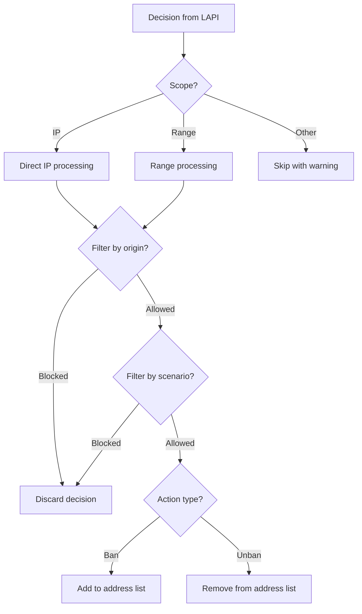

How the bouncer processes incoming CrowdSec decisions.

## Processing flow



## Scope handling

| Scope | Action | Example |
|-------|--------|---------|
| `Ip` | Added directly to address list | `192.168.1.1` |
| `Range` | Added as CIDR to address list | `10.0.0.0/24` |
| Other | Logged as warning, skipped | — |

## Origin filtering

When `origins` is configured, the bouncer only processes decisions from the specified origins:

| Origin | Source |
|--------|--------|
| `crowdsec` | Local CrowdSec engine detections |
| `cscli` | Manual bans via `cscli decisions add` |
| `CAPI` | CrowdSec Central API community blocklists |
| `lists:*` | Third-party blocklist subscriptions |

```yaml
crowdsec:
  origins: ["crowdsec", "cscli"]  # Ignore CAPI community lists
```

When `origins` is empty (default), **all origins are accepted**.

## Scenario filtering

When `scenarios` is configured, the bouncer only processes decisions matching the specified scenarios:

```yaml
crowdsec:
  scenarios:
    - "crowdsecurity/ssh-bf"
    - "crowdsecurity/http-*"
```

Pattern matching with `*` and `?` wildcards is supported.

## Duplicate IP handling

When the same IP appears in multiple decisions (e.g., different scenarios or origins), the bouncer handles this efficiently:

1. **During bans**: Uses the optimistic-add pattern — tries to add and silently handles "already exists" errors
2. **During unbans**: Checks the in-memory cache first and only removes from MikroTik if the IP is actually present
3. **On startup**: Decision collection pre-filters by deduplicating IPs before reconciliation

:::note
Duplicate handling is transparent — the address list only ever contains one entry per IP regardless of how many decisions reference it. The last decision's timeout value is used for the address list entry.
:::
