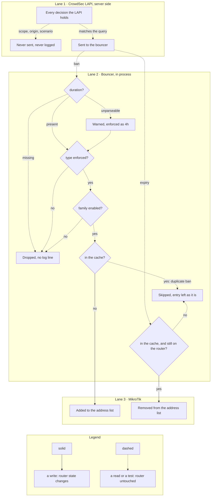

import { Steps, LinkCard } from "@astrojs/starlight/components";

How the bouncer processes incoming CrowdSec decisions.

## Processing flow

A decision can be dropped in two places, and only two: by the **Local API**, which never sends what the bouncer's query excludes, and by the **bouncer itself**, which checks a handful of things before it touches RouterOS. There is no third stage — no in-process rule pipeline, no per-decision policy. Everything that survives both lanes ends up in an address list, and nothing else does.



Two details the lanes flatten. The duration requirement applies to bans and to every decision in a reconciliation snapshot, but not to expiries — those routinely arrive without one. And the expiry lane hides a read: the cache is checked first, and only if the address is in it does the bouncer look the entry up on the router, which is where an entry that expired on MikroTik in the meantime drops out.

<Steps>

1. **Receive decision from LAPI**

   The bouncer fetches new and expired decisions from the CrowdSec Local API.

2. **LAPI-side filtering**

   `scopes`, `origins`, `scenarios_containing` and `scenarios_not_containing` are not local checks: the bouncer sends them as query parameters on the LAPI request, so CrowdSec only returns decisions that already match them. Decisions rejected by these filters never reach the bouncer, so no local log line records them.

   | Query parameter            | Config key                          | Default                  |
   | -------------------------- | ----------------------------------- | ------------------------ |
   | `scopes`                   | `crowdsec.scopes`                   | `["ip", "range"]`        |
   | `origins`                  | `crowdsec.origins`                  | empty — all origins      |
   | `scenarios_containing`     | `crowdsec.scenarios_containing`     | empty — no restriction   |
   | `scenarios_not_containing` | `crowdsec.scenarios_not_containing` | empty — nothing excluded |

   The periodic reconciliation snapshot sends one more: `type=ban`, and only while `crowdsec.supported_decisions_types` is left at its default. The Local API matches that parameter exactly rather than as a set, so a wider configured set has to be fetched whole and narrowed in the bouncer instead. The live stream carries no type filter at all, which is why the type check below is the bouncer's own.

3. **Parse the decision**

   The bouncer keeps only the decision types it is configured to enforce — `ban` unless `crowdsec.supported_decisions_types` names others — and any other type is discarded silently. New decisions that carry no duration are discarded as well. A duration that cannot be parsed is logged as a warning (`failed to parse decision duration`) and falls back to 4h. Each decision that survives parsing **on the live stream** is logged at debug level as `new decision` or `deleted decision`. The periodic reconciliation snapshot parses decisions the same way but logs nothing per decision.

4. **Apply action**
   - **Ban** → Add IP/range to the MikroTik address list
   - **Unban** → Remove IP/range from the address list

   Decisions for a disabled protocol (`firewall.ipv4.enabled` or `firewall.ipv6.enabled` set to `false`) are skipped without a log line. A ban whose address is already in the in-memory cache is skipped with a debug log.

</Steps>

## Origin filtering

When `origins` is configured, the LAPI only sends the bouncer decisions from the specified origins:

| Origin     | Source                                    |
| ---------- | ----------------------------------------- |
| `crowdsec` | Local CrowdSec engine detections          |
| `cscli`    | Manual bans via `cscli decisions add`     |
| `CAPI`     | CrowdSec Central API community blocklists |
| `lists`    | Third-party blocklist subscriptions       |

```yaml
crowdsec:
  origins: ["crowdsec", "cscli"] # Ignore CAPI community lists
```

When `origins` is empty (default), **all origins are accepted**.

## Scenario filtering

Scenario filters use CrowdSec's `scenarios_containing` and `scenarios_not_containing` fields. They match literal substrings in the scenario name, such as `ssh`, `http`, or `crowdsecurity/ssh-bf`.

```yaml
crowdsec:
  scenarios_containing:
    - "ssh"
    - "http"
  scenarios_not_containing:
    - "test"
```

Use `scenarios_containing` to keep only matching scenarios. Use `scenarios_not_containing` to exclude noisy or unwanted scenarios. Both filters travel with the LAPI request, so CrowdSec applies them before it sends anything to the bouncer.

## Duplicate IP handling

When the same IP appears in multiple decisions (e.g., different scenarios or origins), the bouncer handles this efficiently:

1. **During bans**: Checks the in-memory cache first. If the address is already known to be present, the RouterOS API call is skipped.
2. **During unbans**: Checks the in-memory cache first and only removes from MikroTik if the IP is actually present
3. **On startup and periodic reconciliation**: The decision collector deduplicates IPs before reconciliation
4. **After cache misses**: If RouterOS still replies with `already have such entry`, the bouncer treats it as a device-level conflict, keeps the API session open, finds the existing entry, updates its timeout/comment, and records the address in cache. This write path only happens when the address was missing from the local cache.

:::note
Duplicate handling is transparent — the address list only ever contains one entry per IP regardless of how many decisions reference it. Cached duplicate ban events do not refresh the RouterOS timeout during the same run; this avoids repeated RouterOS writes during stream churn. Periodic reconciliation repairs real drift by re-adding addresses that are still active in CrowdSec but missing on MikroTik.
:::

<LinkCard
  title="CrowdSec Configuration"
  description="Configure origins, scenario substring filters, and LAPI connection settings."
  href="/cs-routeros-bouncer/configuration/crowdsec/"
/>
