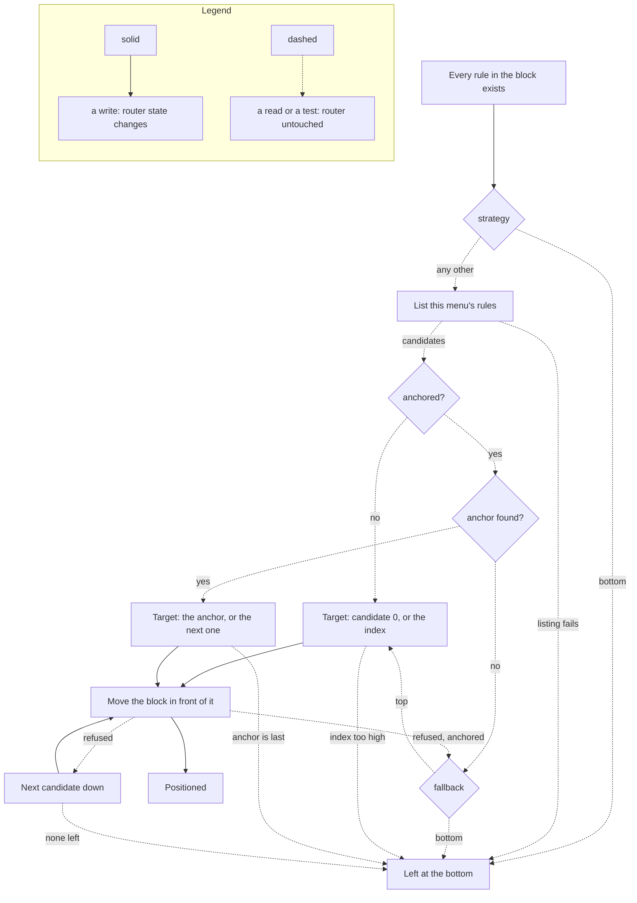

import { Steps, LinkCard } from "@astrojs/starlight/components";
import RuleSet from "../../../components/RuleSet.astro";

How the bouncer creates and manages [RouterOS firewall](https://help.mikrotik.com/docs/spaces/ROS/pages/250708066/Firewall) rules.

## Rules the daemon writes

The bouncer does not write one rule per table. It writes an ordered **block** per chain, and it writes that block once for every protocol family it is enabled for — `firewall.ipv4.enabled` and `firewall.ipv6.enabled` are both `true` by default, so the stock configuration builds every rule below twice, against `crowdsec-banned` for IPv4 and `crowdsec6-banned` for IPv6. A block is also built once per entry in `firewall.filter.chains` and `firewall.raw.chains`; add a chain there and the whole block is repeated in it.

Inside a block the order is fixed — whitelist, counting, deny — and the block is only moved into position once every rule in it exists, so RouterOS never evaluates a half-built block.

### Created by default

<RuleSet scope="default" count />

The two `passthrough` counting rules are the ones no earlier version of this page listed, and they are the reason a stock router shows eight bouncer rules where the documentation used to describe four. They are created by `metrics.track_processed`, which defaults to `true`.

A counting rule matches no address list, carries no `src-address-list`, and takes no decision: `passthrough` in RouterOS only increments the rule's byte and packet counters and moves on. That is deliberate — the bouncer reads those counters to report how much traffic its chains _evaluated_, which is the denominator for how much of it was dropped. It is also why the rule looks, on a router you are auditing by eye, exactly like somebody's forgotten scratch rule. It is not one.

`metrics.track_processed` is read on its own, not behind `metrics.enabled` — which defaults to `false`. A router whose bouncer exposes no metrics endpoint at all still carries both counting rules, quietly counting for nobody. Setting `metrics.track_processed: false` removes them, and with them the `crowdsec_bouncer_processed_*` metrics; the dropped counters, which come from the deny rules themselves, are unaffected.

### Created only when a setting asks for them

<RuleSet scope="conditional" />

## Rule creation flow

On startup, the bouncer follows this sequence:

<Steps>

1. **Check for existing rules**

   Scans for bouncer-managed rules by matching the comment pattern.

2. **Reuse or create**

   A rule whose exact comment is already on the router is adopted, not duplicated; anything missing is created.

3. **Place the block at the configured position**

   Places the managed block according to the effective `rule_placement` for that protocol and table: top, bottom, a numeric RouterOS position, or an anchor comment.

</Steps>

## Rule placement

The bouncer places related rules as ordered blocks. A typical input block includes the following rules in order: `whitelist` (when configured), `counting` (when processed metrics are enabled), then the deny/reject rule. Placement happens after all rules in the block exist, so the internal order stays stable.

Placement is menu-local. A `filter` block is positioned within `/ip firewall filter` or `/ipv6 firewall filter`; a `raw` block is positioned within `/ip firewall raw` or `/ipv6 firewall raw`.

The bouncer can place its managed block (the related rules it creates and moves together) at the top, at the bottom, at a numeric RouterOS `print` position, or relative to an existing comment owned by another rule. If output blocking is enabled, the output block is moved with the same internal ordering. By default, the bouncer reuses the same placement strategy for IPv4 and IPv6. Table and protocol overrides can send `filter`, `raw`, IPv4, and IPv6 blocks to different locations. Precedence is global placement, global table override, protocol override, then protocol table override.

Placement runs against the **candidates**: every rule already in that menu whose comment does not carry the `@cs-routeros-bouncer` signature. The bouncer's own rules are excluded from that count, so a numeric `position` means the same place whether or not the block is already on the router. The diagram below is the whole mechanism, retries included — each rung that fails falls to the next, and the last rung is always _leave the block where RouterOS appended it_. Placement never aborts startup.



Two rungs are worth reading twice. The retry is per candidate, not per attempt: when RouterOS refuses to move the block in front of a rule — a dynamic or built-in rule, for instance — the bouncer targets the next rule down and tries again, which is why a `top` block can settle a few positions lower than the name suggests. And `fallback` only exists for the comment strategies; a numeric `position` past the end has no anchor to miss, so it appends instead.

A move is not atomic across the block either. Each rule is moved on its own, in block order, so a failure part-way through can leave the block split around the target; the ordering is completed by the next placement pass.

| Strategy         | Behavior                                                                                                                                                                       |
| ---------------- | ------------------------------------------------------------------------------------------------------------------------------------------------------------------------------ |
| `top`            | Moves the block before the first usable non-bouncer rule. If RouterOS refuses the position, for example before dynamic or built-in rules, the bouncer retries lower positions. |
| `bottom`         | Leaves newly-created rules appended at the end.                                                                                                                                |
| `position`       | Requires `position` and uses zero-based RouterOS `print` numbering, excluding existing bouncer rules. Out-of-range positions append at bottom.                                 |
| `before_comment` | Moves the block before the first non-bouncer rule whose comment matches the configured anchor.                                                                                 |
| `after_comment`  | Moves the block after the matched anchor by inserting before the next non-bouncer rule; if the anchor is last, the block remains appended.                                     |

Comment placement uses `fallback` (`top` by default, or `bottom`) when the anchor is missing or cannot be used. Numeric `position` ignores `fallback` because an out-of-range position naturally means append.

## Rule identification

Rules are identified by a structured comment:

```text
{prefix}:{type}-{chain}-{direction}-{protocol} @cs-routeros-bouncer
```

| Part        | Values                                                          |
| ----------- | --------------------------------------------------------------- |
| `prefix`    | Configurable via `comment_prefix` (default: `crowdsec-bouncer`) |
| `type`      | `filter` or `raw`                                               |
| `chain`     | `input`, `forward`, `prerouting`, `output`                      |
| `direction` | `input`, `output`, `whitelist`, or `counting`                   |
| `protocol`  | `v4` or `v6`                                                    |

RouterOS prints the comment above the rule it belongs to, so the whole managed block is visible in one query:

```routeros
/ip/firewall/filter print where comment~"crowdsec"
# 0  ;;; crowdsec-bouncer:filter-input-counting-v4 @cs-routeros-bouncer
#       chain=input action=passthrough
# 1  ;;; crowdsec-bouncer:filter-input-input-v4 @cs-routeros-bouncer
#       chain=input action=drop src-address-list=crowdsec-banned
```

:::note
The `@cs-routeros-bouncer` suffix is always appended and is used to distinguish rules created by this bouncer from rules that may happen to have similar comments. It is not configurable, which is what makes crash recovery possible after `comment_prefix` has been changed.
:::

## Cleanup, and what is left behind

When the bouncer receives SIGTERM or SIGINT:

<Steps>

1. **Remove the rules**

   Every firewall rule the bouncer created is removed, counting rules included.

2. **Leave the address lists alone**

   Address-list entries are **not** removed. They expire on the MikroTik timeout they were written with, which is the duration of the CrowdSec decision that created them.

</Steps>

This design means protection continues after the bouncer stops, for whatever is left of each entry's timeout, and a quick restart never leaves the router unprotected in the gap. It also means no mass delete has to run during shutdown.

:::caution
A decision whose duration resolves to zero or less is written with **no timeout at all** — CrowdSec does emit negative remaining durations. (A decision carrying no duration field at all is discarded in `parseDecisionBatch` and never reaches the router.) That entry does not expire: it stays in the address list until the next reconciliation drops it, or until you remove it by hand. The rules disappear with the daemon; those entries do not.
:::

<LinkCard
  title="Firewall Configuration"
  description="Configure rule types, placement, logging, and advanced customizations."
  href="/cs-routeros-bouncer/configuration/firewall/"
/>
