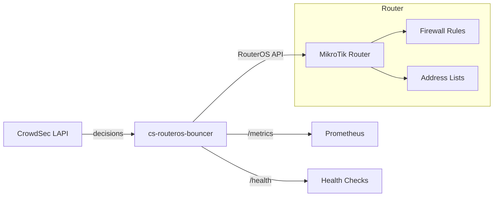
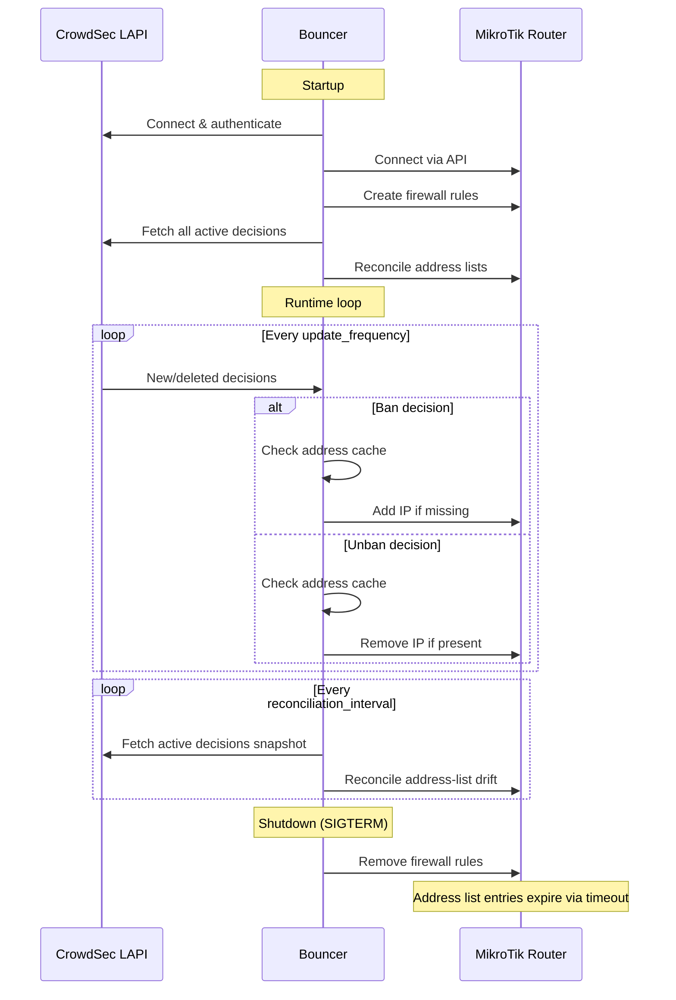

import { LinkCard, CardGrid } from "@astrojs/starlight/components";

cs-routeros-bouncer acts as a bridge between CrowdSec's threat intelligence and MikroTik's firewall.

## Overview



## Deep-dive topics

<CardGrid>
  <LinkCard
    title="Firewall Rules"
    description="How rules are created, identified, placed, and cleaned up."
    href="/cs-routeros-bouncer/architecture/firewall-rules/"
  />
  <LinkCard
    title="Decision Processing"
    description="How CrowdSec decisions are filtered and applied."
    href="/cs-routeros-bouncer/architecture/decisions/"
  />
  <LinkCard
    title="Reconciliation"
    description="Startup sync and diff-based address-list management."
    href="/cs-routeros-bouncer/architecture/reconciliation/"
  />
</CardGrid>

## Components

The bouncer is composed of several internal packages:

| Package                   | Responsibility                                                  |
| ------------------------- | --------------------------------------------------------------- |
| `cmd/cs-routeros-bouncer` | CLI entrypoint, subcommand routing                              |
| `internal/config`         | Configuration loading, validation, environment variable binding |
| `internal/crowdsec`       | CrowdSec LAPI streaming client                                  |
| `internal/routeros`       | RouterOS API client (addresses, firewall rules)                 |
| `internal/manager`        | Central orchestrator — ties everything together                 |
| `internal/metrics`        | Prometheus metrics and health endpoint                          |

## Data flow



## Design principles

### Comment-based identification

All resources created by the bouncer in MikroTik are tagged with a structured comment:

```text
{comment_prefix}:{type}-{chain}-{direction}-{protocol} @cs-routeros-bouncer
```

Examples:

- `crowdsec-bouncer:filter-input-input-v4 @cs-routeros-bouncer`
- `crowdsec-bouncer:raw-prerouting-input-v6 @cs-routeros-bouncer`

This allows the bouncer to precisely identify and manage its own resources without affecting user-created rules.

### Cache-first optimistic add

When processing a ban decision, the bouncer first checks its in-memory address cache:

1. If the address is already in cache, the RouterOS API call is skipped entirely.
2. If the address is not in cache, try to add it directly (~1–3 ms).
3. If RouterOS returns `already have such entry`, treat it as a device-level conflict, keep the connection open, find the existing entry, and update its timeout/comment.

This is significantly faster than the "check-first" approach (~400 ms per IP), which would require listing all entries first.

### Connection pool

The bouncer maintains a configurable pool of persistent RouterOS API connections. During reconciliation, work is distributed across the pool using the generic `ParallelExec` helper; on an RB5009 with `pool_size: 10`, full RouterOS bulk-add work for ~28,700 CAPI-origin entries completed in ~35–36 s.

### Script-based bulk add

For initial reconciliation, the bouncer generates RouterOS scripts that add entries in chunks of 100 IPs per script. Each entry uses `:do { ... } on-error={}` to gracefully skip duplicates. This approach is ~97× faster than individual sequential API calls for large lists.

### In-memory address cache

An in-memory map (`map[string]struct{}` with `sync.RWMutex`) tracks all addresses currently on the router. This provides:

- **O(1) unban lookups**: When an IP is unbanned, the cache is checked first. If the IP is not in the cache (e.g., already expired on the router), the API call is skipped entirely.
- **O(1) duplicate-ban fast path**: Repeated ban events for addresses already known to be on the router return immediately without creating RouterOS management/API churn.
- **Pre-filtering during startup**: Deletes received during initial decision collection are pre-filtered against incoming bans to avoid unnecessary work.

### Single named address lists

Unlike some bouncers that create timestamped lists, cs-routeros-bouncer uses a single named address list per protocol:

- `crowdsec-banned` for IPv4
- `crowdsec6-banned` for IPv6

Firewall rules reference these lists by name, which is more efficient and avoids the duplication problem.

### Diff-based reconciliation

On startup, and then periodically at `crowdsec.reconciliation_interval`, the bouncer performs a diff between CrowdSec's active decisions and MikroTik's current address list state:

1. Fetch all active decisions from CrowdSec
2. Fetch all entries in the address list from MikroTik
3. Compare the two sets
4. Add missing entries (in CrowdSec but not in MikroTik)
5. Remove stale entries (in MikroTik but not in CrowdSec)

This keeps membership synchronized regardless of how the bouncer was stopped, what happened while it was offline, or whether RouterOS-side entries expired while CrowdSec still considered them active.
