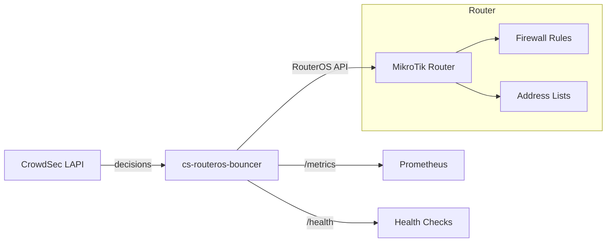
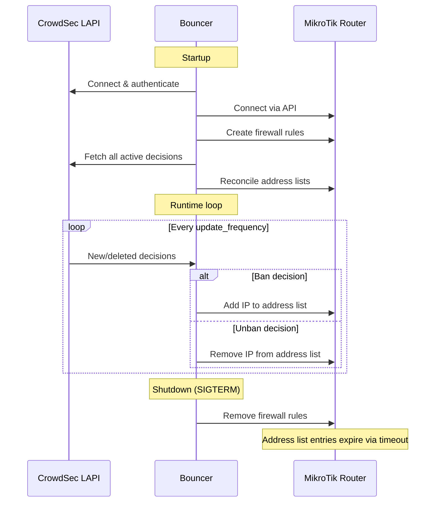

import { LinkCard, CardGrid } from '@astrojs/starlight/components';

cs-routeros-bouncer acts as a bridge between CrowdSec's threat intelligence and MikroTik's firewall.

## Overview



## Deep-dive topics

<CardGrid>
  <LinkCard title="Firewall Rules" description="How rules are created, identified, placed, and cleaned up." href="/cs-routeros-bouncer/architecture/firewall-rules/" />
  <LinkCard title="Decision Processing" description="How CrowdSec decisions are filtered and applied." href="/cs-routeros-bouncer/architecture/decisions/" />
  <LinkCard title="Reconciliation" description="Startup sync and diff-based address-list management." href="/cs-routeros-bouncer/architecture/reconciliation/" />
</CardGrid>

## Components

The bouncer is composed of several internal packages:

| Package | Responsibility |
|---------|---------------|
| `cmd/cs-routeros-bouncer` | CLI entrypoint, subcommand routing |
| `internal/config` | Configuration loading, validation, environment variable binding |
| `internal/crowdsec` | CrowdSec LAPI streaming client |
| `internal/routeros` | RouterOS API client (addresses, firewall rules) |
| `internal/manager` | Central orchestrator — ties everything together |
| `internal/metrics` | Prometheus metrics and health endpoint |

## Data flow



## Design principles

### Comment-based identification

All resources created by the bouncer in MikroTik are tagged with a structured comment:

```
{comment_prefix}:{type}-{chain}-{direction}-{protocol} @cs-routeros-bouncer
```

Examples:

- `crowdsec-bouncer:filter-input-input-v4 @cs-routeros-bouncer`
- `crowdsec-bouncer:raw-prerouting-input-v6 @cs-routeros-bouncer`

This allows the bouncer to precisely identify and manage its own resources without affecting user-created rules.

### Optimistic-add pattern

When adding an IP to the address list, the bouncer uses an "optimistic-add" approach:

1. Try to add the IP directly (~1–3 ms)
2. If RouterOS returns "already have such entry", silently succeed

This is significantly faster than the "check-first" approach (~400 ms per IP), which would require listing all entries first.

### Connection pool

The bouncer maintains a pool of 4 persistent RouterOS API connections. During reconciliation, work is distributed across all connections in parallel using the generic `ParallelExec` helper, achieving ~147–168 IPs/s throughput.

### Script-based bulk add

For initial reconciliation, the bouncer generates RouterOS scripts that add entries in chunks of 100 IPs per script. Each entry uses `:do { ... } on-error={}` to gracefully skip duplicates. This approach is ~97× faster than individual sequential API calls for large lists.

### In-memory address cache

An in-memory map (`map[string]struct{}` with `sync.RWMutex`) tracks all addresses currently on the router. This provides:

- **O(1) unban lookups**: When an IP is unbanned, the cache is checked first. If the IP is not in the cache (e.g., already expired on the router), the API call is skipped entirely.
- **Pre-filtering during startup**: Deletes received during initial decision collection are pre-filtered against incoming bans to avoid unnecessary work.

### Single named address lists

Unlike some bouncers that create timestamped lists, cs-routeros-bouncer uses a single named address list per protocol:

- `crowdsec-banned` for IPv4
- `crowdsec6-banned` for IPv6

Firewall rules reference these lists by name, which is more efficient and avoids the duplication problem.

### Diff-based reconciliation

On startup, the bouncer performs a diff between CrowdSec's active decisions and MikroTik's current address list state:

1. Fetch all active decisions from CrowdSec
2. Fetch all entries in the address list from MikroTik
3. Compare the two sets
4. Add missing entries (in CrowdSec but not in MikroTik)
5. Remove stale entries (in MikroTik but not in CrowdSec)

This ensures perfect synchronization regardless of how the bouncer was stopped or what happened while it was offline.
