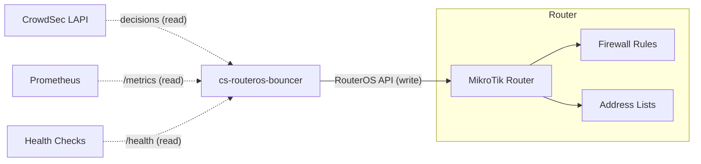
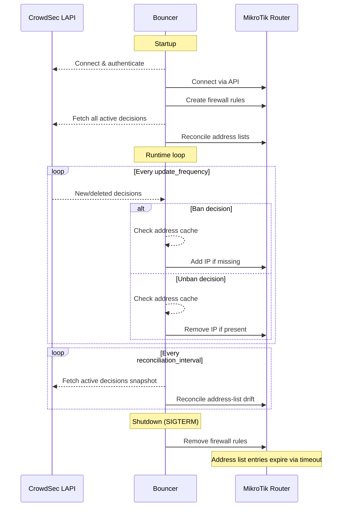
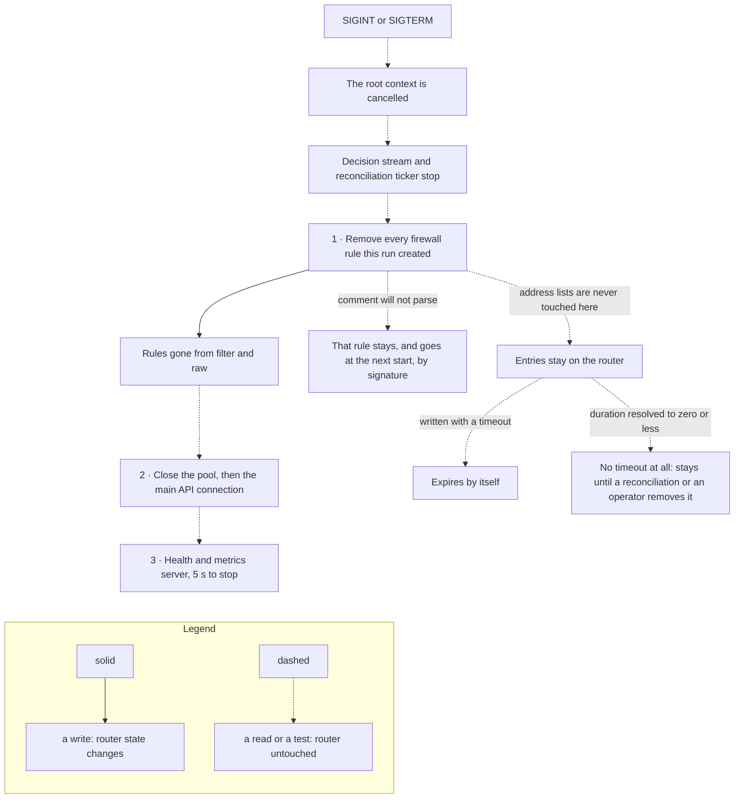

import { LinkCard, CardGrid } from "@astrojs/starlight/components";
import ThemeImage from "../../../components/ThemeImage.astro";

cs-routeros-bouncer acts as a bridge between CrowdSec's threat intelligence and MikroTik's firewall.

## Overview


```mermaid
flowchart LR
    accTitle: cs-routeros-bouncer architecture overview
    accDescr: CrowdSec LAPI sends ban and unban decisions to cs-routeros-bouncer, which applies them to the MikroTik router through the RouterOS API, exposes Prometheus metrics, and serves health checks. The router applies the changes to its firewall rules and address lists.
    CS[CrowdSec LAPI] -. "decisions (read)" .-> B[cs-routeros-bouncer]
    B -->|"RouterOS API (write)"| R[MikroTik Router]
    P[Prometheus] -. "/metrics (read)" .-> B
    H[Health Checks] -. "/health (read)" .-> B

    subgraph Router
        R --> FW[Firewall Rules]
        R --> AL[Address Lists]
    end
```

The two branches on the right of that diagram are not decoration. `/metrics` is the Prometheus endpoint the shipped dashboard reads, and `/health` is the endpoint a container health check calls; both are served by the same HTTP server, which starts even when metrics are disabled.

<ThemeImage
  src="grafana-dashboard-light.png"
  alt="The Grafana dashboard shipped with cs-routeros-bouncer, showing panels for active decisions, decision rate by origin, firewall traffic counters and RouterOS system health."
  caption="The /metrics branch, rendered: grafana/dashboard.json in the repository."
/>

## Reading the diagrams

Every diagram on this site draws the same distinction between what the bouncer writes and what it reads, because it is the one that matters when you are working out what the bouncer does to your router:

- A **solid** edge is a **write**. Router state changes: an address-list entry appears or disappears, a firewall rule is created, moved or removed.
- A **dashed** edge is a **read**, a test, or a discard. Nothing on the router changes: decisions stream in from the LAPI, an address list is listed, drift is measured, a decision is dropped.

Three channels carry that distinction, so a diagram still reads in greyscale, with any form of colour vision deficiency, and on paper: the line pattern, then colour, then a legend drawn inside each diagram from those same two edges. The convention is written down in `docs/src/styles/diagram.css`; the colours come from `docs/src/styles/theme.css` at build time, so diagrams follow the palette instead of pinning their own.

## Deep-dive topics

<CardGrid>
  <LinkCard
    title="Firewall Rules"
    description="How rules are created, identified, placed, and cleaned up."
    href="/cs-routeros-bouncer/architecture/firewall-rules/"
  />
  <LinkCard
    title="Decision Processing"
    description="How CrowdSec decisions are filtered and applied."
    href="/cs-routeros-bouncer/architecture/decisions/"
  />
  <LinkCard
    title="Reconciliation"
    description="Startup sync and diff-based address-list management."
    href="/cs-routeros-bouncer/architecture/reconciliation/"
  />
</CardGrid>

## Components

The bouncer is composed of several internal packages:

| Package                   | Responsibility                                                  |
| ------------------------- | --------------------------------------------------------------- |
| `cmd/cs-routeros-bouncer` | CLI entrypoint, subcommand routing                              |
| `internal/config`         | Configuration loading, validation, environment variable binding |
| `internal/crowdsec`       | CrowdSec LAPI streaming client                                  |
| `internal/routeros`       | RouterOS API client (addresses, firewall rules)                 |
| `internal/manager`        | Central orchestrator — ties everything together                 |
| `internal/metrics`        | Prometheus metrics and health endpoint                          |

## Data flow


```mermaid
sequenceDiagram
    accTitle: cs-routeros-bouncer startup and runtime data flow
    accDescr: At startup the bouncer connects to CrowdSec and MikroTik, creates firewall rules, fetches active decisions, and reconciles address lists. During the runtime loop it adds or removes IPs as CrowdSec reports new or expired decisions, checking its address cache first. On a fixed interval it reconciles again to repair drift. On shutdown (SIGTERM) it removes its firewall rules while address-list entries expire via their own timeout.
    participant CS as CrowdSec LAPI
    participant B as Bouncer
    participant MT as MikroTik Router

    Note over B: Startup
    B-->>CS: Connect & authenticate
    B->>MT: Connect via API
    B->>MT: Create firewall rules
    B-->>CS: Fetch all active decisions
    B->>MT: Reconcile address lists

    Note over B: Runtime loop
    loop Every update_frequency
        CS-->>B: New/deleted decisions
        alt Ban decision
            B-->>B: Check address cache
            B->>MT: Add IP if missing
        else Unban decision
            B-->>B: Check address cache
            B->>MT: Remove IP if present
        end
    end

    loop Every reconciliation_interval
        B-->>CS: Fetch active decisions snapshot
        B->>MT: Reconcile address-list drift
    end

    Note over B: Shutdown (SIGTERM)
    B->>MT: Remove firewall rules
    Note over MT: Address list entries expire via timeout
```

## Shutdown and cleanup

Stopping the bouncer removes its firewall rules and leaves the blocked addresses where they are. That asymmetry is deliberate: rules are cheap to recreate and confusing to find abandoned on a router, while the address-list entries are what actually carries the protection, and dropping tens of thousands of them on every restart would open a gap and pay for it again on the way back up.


```mermaid
flowchart TB
    accTitle: Shutdown order, and what is deliberately left on the router
    accDescr: A SIGINT or SIGTERM cancels the root context, which stops the decision stream and the reconciliation ticker. The manager then removes every firewall rule this run created, closes the connection pool and the main API connection, and finally gives the health and metrics server five seconds to stop. A rule whose comment cannot be parsed is left on the router and removed at the next start, which searches by the fixed bouncer signature. Address-list entries are never touched during shutdown: an entry written with a timeout expires on its own, while an entry created from a decision whose duration resolved to zero or less has no timeout at all and stays until a later reconciliation or an operator removes it. A decision carrying no duration field is discarded before this point.
    SIG["SIGINT or SIGTERM"] -.-> CTX["The root context is cancelled"]
    CTX -.-> STOP["Decision stream and reconciliation ticker stop"]
    STOP -.-> RULES["1 · Remove every firewall rule this run created"]
    RULES --> GONE["Rules gone from filter and raw"]
    RULES -. "comment will not parse" .-> LEFT["That rule stays, and goes at the next start, by signature"]
    GONE -.-> CLOSE["2 · Close the pool, then the main API connection"]
    CLOSE -.-> HEALTH["3 · Health and metrics server, 5 s to stop"]
    RULES -. "address lists are never touched here" .-> KEEP["Entries stay on the router"]
    KEEP -. "written with a timeout" .-> EXP["Expires by itself"]
    KEEP -. "duration resolved to zero or less" .-> NOEXP["No timeout at all: stays until a reconciliation or an operator removes it"]

    HEALTH ~~~ LEG
    subgraph LEG["Legend"]
        direction TB
        LA["solid"] --> LB["a write: router state changes"]
        LC["dashed"] -.-> LD["a read or a test: router untouched"]
    end
```

Removal is driven by the ids this run recorded when it created or adopted each rule, and the comment is parsed back to find which menu the rule lives in. A comment the parser does not recognise — after a `comment_prefix` change mid-run, say — is logged and skipped, which is exactly the case the next startup sweep is for: it searches by the fixed `@cs-routeros-bouncer` signature, so it finds bouncer rules whatever prefix wrote them. The same sweep is what cleans up after a crash, where `Shutdown` never ran at all.

Closing the RouterOS connection also marks the bouncer disconnected, so `/health` reports the true state for whatever is left of the shutdown window.

## Design principles

### Comment-based identification

All resources created by the bouncer in MikroTik are tagged with a structured comment:

```text
{comment_prefix}:{type}-{chain}-{direction}-{protocol} @cs-routeros-bouncer
```

Examples:

- `crowdsec-bouncer:filter-input-input-v4 @cs-routeros-bouncer`
- `crowdsec-bouncer:raw-prerouting-input-v6 @cs-routeros-bouncer`

This allows the bouncer to precisely identify and manage its own resources without affecting user-created rules.

### Cache-first optimistic add

When processing a ban decision, the bouncer first checks its in-memory address cache:

1. If the address is already in cache, the RouterOS API call is skipped entirely.
2. If the address is not in cache, try to add it directly (~1–3 ms).
3. If RouterOS returns `already have such entry`, treat it as a device-level conflict, keep the connection open, find the existing entry, and update its timeout/comment.

This is significantly faster than the "check-first" approach (~400 ms per IP), which would require listing all entries first.

### Connection pool

The bouncer maintains a configurable pool of persistent RouterOS API connections. The pool serves removals only: during reconciliation, stale entries are deleted concurrently across the pool using the generic `ParallelExec` helper. In the RB5009 CAPI test, removing ~26,800 CAPI-only entries took ~77 s of RouterOS removal work. If the pool cannot be opened, removals fall back to the main connection.

### Script-based bulk add

For initial reconciliation, the bouncer generates RouterOS scripts that add entries in chunks of 100 IPs per script. Each entry uses `:do { ... } on-error={}` to gracefully skip duplicates. Bulk adds do not use the connection pool: they run sequentially over the main connection. This approach is still ~97× faster than individual sequential API calls for large lists — measured on an RB5009UG+S+ (RouterOS 7.22.1), where ~28,700 CAPI entries took ~35–36 s of RouterOS bulk-add work; see [Benchmarking](/cs-routeros-bouncer/development/benchmarking/) for the methodology.

### In-memory address cache

An in-memory map (`map[string]struct{}` with `sync.RWMutex`) tracks all addresses currently on the router. This provides:

- **O(1) unban lookups**: When an IP is unbanned, the cache is checked first. If the IP is not in the cache (e.g., already expired on the router), the API call is skipped entirely.
- **O(1) duplicate-ban fast path**: Repeated ban events for addresses already known to be on the router return immediately without creating RouterOS management/API churn.
- **Pre-filtering during startup**: Deletes received during initial decision collection are pre-filtered against incoming bans to avoid unnecessary work.

### Single named address lists

Unlike some bouncers that create timestamped lists, cs-routeros-bouncer uses a single named address list per protocol:

- `crowdsec-banned` for IPv4
- `crowdsec6-banned` for IPv6

Firewall rules reference these lists by name, which is more efficient and avoids the duplication problem.

### Diff-based reconciliation

On startup, and then periodically at `crowdsec.reconciliation_interval`, the bouncer performs a diff between CrowdSec's active decisions and MikroTik's current address list state:

1. Fetch all active decisions from CrowdSec
2. Fetch all entries in the address list from MikroTik
3. Compare the two sets
4. Add missing entries (in CrowdSec but not in MikroTik)
5. Remove stale entries (in MikroTik but not in CrowdSec)

This keeps membership synchronized regardless of how the bouncer was stopped, what happened while it was offline, or whether RouterOS-side entries expired while CrowdSec still considered them active.
