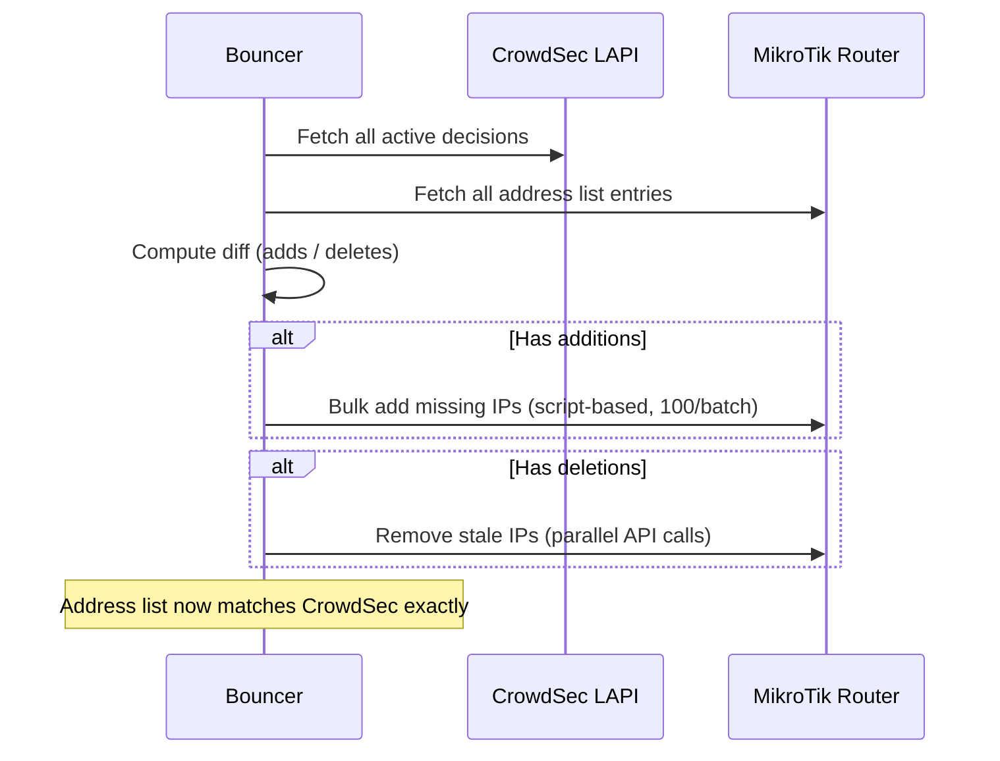

How the bouncer ensures address lists are perfectly synchronized with CrowdSec decisions.

## The reconciliation problem

When the bouncer starts (or restarts), the MikroTik address list may be out of sync with CrowdSec's active decisions:

- IPs may have been added to CrowdSec while the bouncer was offline
- IPs may have expired in CrowdSec but still be in the MikroTik list
- Previous bouncer entries may still exist from a prior run

## Reconciliation process



## Algorithm

1. **Collect** — Fetch all active decisions from CrowdSec and all address list entries from MikroTik
2. **Diff** — Determine which IPs need to be added and which removed
3. **Apply** — Execute additions (via bulk scripts) and deletions (via parallel API calls)
4. **Verify** — Log final counts and comparison

## Performance

Measured on a MikroTik hAP ax³ (ARM64, 1 GHz quad-core, 1 GB RAM):

| Metric | Local-only (~1,500 IPs) | Full CAPI (~25,000 IPs) |
|--------|------------------------|------------------------|
| Reconciliation time | ~9 s | ~2 min 50 s |
| CPU peak | ~14% | ~23% |
| IPs/second (add) | ~166 | ~147 |
| IPs/second (delete) | ~168 | ~168 |

## Optimizations

### Script-based bulk add

Instead of individual API calls (~97× slower), the bouncer generates RouterOS scripts:

```routeros
/system/script/run [find name="cs-bulk-add-0"]
```

Each script adds up to 100 IPs using `:do { ... } on-error={}` to handle duplicates gracefully.

### Parallel deletion

Deletions use a 4-connection pool with concurrent API calls, achieving ~168 IPs/second throughput via the generic `ParallelExec` helper.

### Pre-filtering

During initial decision collection, if a ban and corresponding unban are received for the same IP, the unban pre-filters the ban out of the pending set. This avoids adding and immediately removing the same IP.

## Related

- [Prometheus Metrics](/monitoring/prometheus/) — reconciliation-related metrics
- [Grafana Dashboard](/monitoring/grafana/) — visual reconciliation monitoring

:::tip
If reconciliation takes too long, consider using `origins` filtering to limit the number of synced decisions. Local-only (~1,500 IPs) reconciles ~19× faster than full CAPI (~25,000 IPs).
:::
