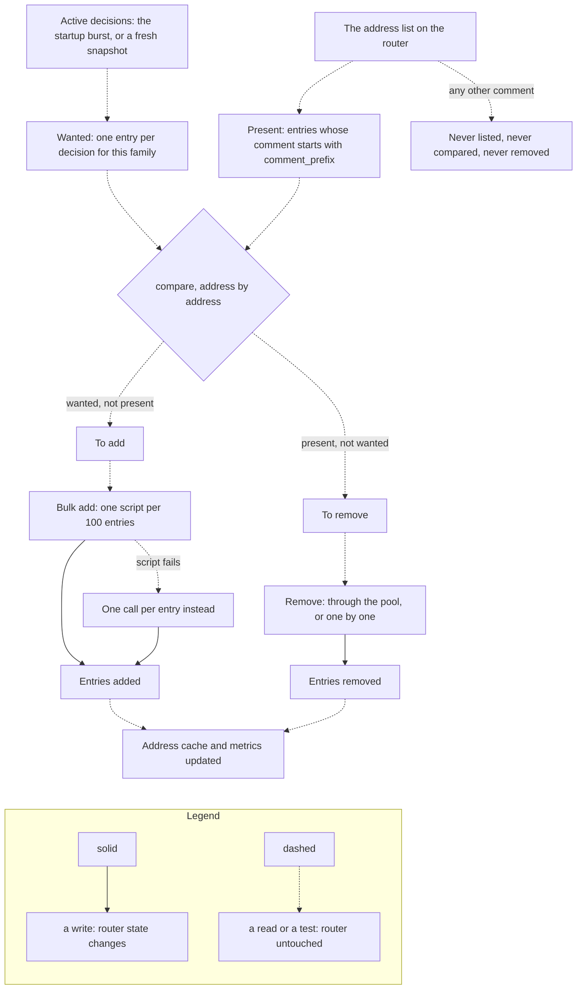

import { Steps, LinkCard, CardGrid } from "@astrojs/starlight/components";

How the bouncer keeps MikroTik address-list membership synchronized with CrowdSec decisions.

## The reconciliation problem

When the bouncer starts (or restarts), or during the periodic reconciliation interval, the MikroTik address list may be out of sync with CrowdSec's active decisions:

- IPs may have been added to CrowdSec while the bouncer was offline
- IPs may have expired in CrowdSec but still be in the MikroTik list
- IPs may have expired or been removed manually on MikroTik while still active in CrowdSec
- Previous bouncer entries may still exist from a prior run

By default, reconciliation runs at startup and then every `15m`. Configure `crowdsec.reconciliation_interval` to change this cadence. Set it to `0` to disable periodic reconciliation; values below `1m` are rejected at startup, so use `0` to disable or a duration of `1m` or greater to enable.

## Reconciliation process

<Steps>

1. **Collect**

   Fetch all active decisions from CrowdSec and all address-list entries from MikroTik.

2. **Diff**

   Compare the two sets to determine which IPs need to be added and which removed.

3. **Apply**

   Execute additions (via bulk scripts, 100 IPs/batch) and deletions (via parallel API calls using the configured connection pool).

4. **Populate cache and verify**

   Populate the in-memory address cache and log final counts to confirm address-list membership matches CrowdSec.

</Steps>

The diff itself is per protocol family and per address list. Two sets go in — what CrowdSec says should be blocked, and what the router currently holds — and two lists come out.



The prefix filter on the _present_ set is what makes reconciliation safe to point at a shared list. The bouncer asks RouterOS for the list by name and then keeps only the entries whose comment starts with the configured `comment_prefix`, so an address you added by hand — or one another tool maintains — is not in the comparison at all, and the "present, not wanted" branch can never reach it.

The comparison is by normalised address, not by decision: several decisions for the same IP collapse to one wanted entry, and only the last one read supplies the timeout and comment written with it.

## Performance

Measured on a MikroTik RB5009UG+S+ (ARM64, 4 cores @ 1400 MHz, 1 GB RAM, RouterOS 7.22.1) with `mikrotik.pool_size: 10`:

| Metric                         | Full CAPI (~28,700 IPs)                            |
| ------------------------------ | -------------------------------------------------- |
| Cold reconciliation wall-clock | ~58 s                                              |
| RouterOS bulk add work         | ~35–36 s                                           |
| Router CPU peak observed       | ~39% during large add/remove churn                 |
| No-drift periodic check        | ~3–4 s, with no add/remove writes                  |
| CAPI → local-only mass removal | ~26,800 removals in ~77 s of RouterOS removal work |

:::note[Router CPU]
Router CPU spikes are expected during reconciliation because the bouncer is adding or removing many address-list entries. After reconciliation, RouterOS CPU should settle back near normal idle/traffic levels. Sustained high CPU usually indicates repeated API writes/reconnects or unrelated router workload, not the address-list entries simply existing in memory.
:::

Periodic reconciliation is usually light: when there is no drift, it lists current address-list entries, compares them with the active CrowdSec snapshot, updates counters, and performs no add/remove writes.

## Optimizations

### Script-based bulk add

Instead of individual API calls (~97× slower), the bouncer uploads a temporary RouterOS script named `crowdsec-bulk-import` and runs it by its internal id:

```routeros
/system/script/run =number=<script-id>
```

Each script run adds up to 100 IPs using `:do { ... } on-error={}` to handle duplicates gracefully.

### Parallel deletion

Deletions use the configured connection pool with concurrent API calls. In the RB5009 CAPI test, removing ~26,800 CAPI-only entries took ~77 s of RouterOS removal work.

### Pre-filtering

During initial decision collection, if a ban and corresponding unban are received for the same IP, the unban pre-filters the ban out of the pending set. This avoids adding and immediately removing the same IP.

:::tip
If reconciliation takes too long, consider using `origins` filtering to limit the number of synced decisions. Local-only deployments are much smaller than full CAPI blocklists and cause less startup and restart churn.
:::

<CardGrid>
  <LinkCard
    title="Prometheus Metrics"
    description="Reconciliation-related metrics for monitoring."
    href="/cs-routeros-bouncer/monitoring/prometheus/"
  />
  <LinkCard
    title="Grafana Dashboard"
    description="Visual reconciliation monitoring."
    href="/cs-routeros-bouncer/monitoring/grafana/"
  />
</CardGrid>
