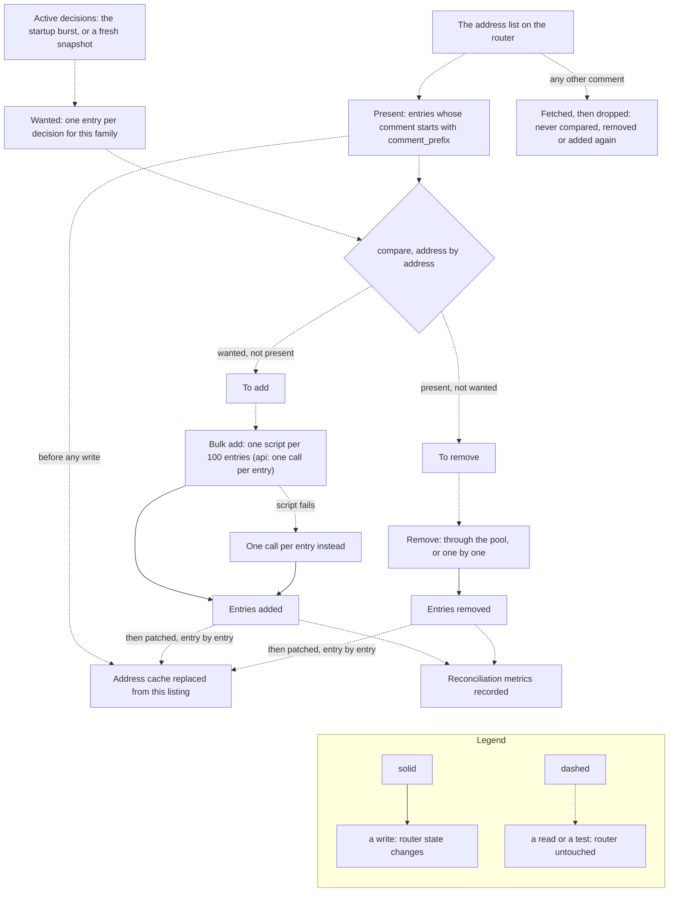

import { Steps, LinkCard, CardGrid } from "@astrojs/starlight/components";

How the bouncer keeps MikroTik address-list membership synchronized with CrowdSec decisions.

## The reconciliation problem

When the bouncer starts (or restarts), or during the periodic reconciliation interval, the MikroTik address list may be out of sync with CrowdSec's active decisions:

- IPs may have been added to CrowdSec while the bouncer was offline
- IPs may have expired in CrowdSec but still be in the MikroTik list
- IPs may have expired or been removed manually on MikroTik while still active in CrowdSec
- Previous bouncer entries may still exist from a prior run

By default, reconciliation runs at startup and then every `15m`. Configure `crowdsec.reconciliation_interval` to change this cadence. Set it to `0` to disable periodic reconciliation; values below `1m` are rejected at startup, so use `0` to disable or a duration of `1m` or greater to enable.

## Reconciliation process

<Steps>

1. **Collect**

   Fetch all active decisions from CrowdSec and all address-list entries from MikroTik.

   At startup the decisions are the CrowdSec stream's first answer, so the first reconciliation waits until the LAPI has answered. An unreachable LAPI produces no decisions at all, and reconciling on that empty set would remove every entry the bouncer owns; instead the bouncer logs a warning every 30 s and leaves the router's lists as they are. A periodic pass whose snapshot request fails is skipped for the same reason.

2. **Diff**

   Compare the two sets to determine which IPs need to be added and which removed.

3. **Refresh the cache**

   Replace this family's in-memory address cache with what the router just reported — before a single add or remove goes out, so the live ban and unban handlers stop trusting entries the router no longer has.

4. **Apply**

   Execute additions (via bulk scripts, 100 IPs/batch, or with `bulk_add_method: api` one API call per entry, over the pool when it opened and one by one on the main connection when it did not) and deletions (parallel API calls through the connection pool when it opened, one by one on the main connection when it did not). Additions patch the cache with the entries not reported failed, deletions with what they attempted. An entry reported failed may still have reached the router, so it is kept as uncertain until the next listing: a live ban adds it, and a live unban looks it up on the router instead of skipping it.

5. **Verify**

   Record the reconciliation metrics and log final counts to confirm address-list membership matches CrowdSec.

</Steps>

The diff itself is per protocol family and per address list. Two sets go in — what CrowdSec says should be blocked, and what the router currently holds — and two lists come out.


```mermaid
flowchart TB
    accTitle: The reconciliation diff: snapshot in, router state in, adds and removes out
    accDescr: A snapshot of active decisions becomes the wanted set, one entry per decision for this protocol family, keyed by normalised address. The address list on the router becomes the present set, but only the entries whose comment starts with the configured comment prefix; entries with any other comment are fetched from the router and then dropped client-side, so they are never compared, never removed and their addresses never added again — but they do cost transfer on every pass. Comparing the two sets address by address yields the entries to add and the entries to remove. The in-memory address cache is replaced from that same listing before any write goes out. Additions then go through a bulk RouterOS script of up to a hundred entries, dropping to one API call per entry when a script fails, or with bulk_add_method api through one API call per entry over the pool; removals go through the connection pool when it opened, and one by one on the main connection otherwise. Each add patches the cache again with the entries not reported failed and each remove with what it attempted, and the reconciliation metrics are recorded once both have run.
    SNAP["Active decisions: the startup burst, or a fresh snapshot"] -.-> WANT["Wanted: one entry per decision for this family"]
    LIST["The address list on the router"] -.-> HAVE["Present: entries whose comment starts with comment_prefix"]
    LIST -. "any other comment" .-> FOREIGN["Fetched, then dropped: never compared, removed or added again"]
    HAVE -. "before any write" .-> CACHE["Address cache replaced from this listing"]
    WANT -.-> DIFF{"compare, address by address"}
    HAVE -.-> DIFF
    DIFF -. "wanted, not present" .-> TOADD["To add"]
    DIFF -. "present, not wanted" .-> TOREM["To remove"]
    TOADD -.-> BULK["Bulk add: one script per 100 entries (api: one call per entry)"]
    BULK -. "script fails" .-> ONEBY["One call per entry instead"]
    TOREM -.-> DELE["Remove: through the pool, or one by one"]
    BULK --> ADDED["Entries added"]
    ONEBY --> ADDED
    DELE --> REMOVED["Entries removed"]
    ADDED -. "then patched, entry by entry" .-> CACHE
    REMOVED -. "then patched, entry by entry" .-> CACHE
    ADDED -.-> MET["Reconciliation metrics recorded"]
    REMOVED -.-> MET

    MET ~~~ LEG
    subgraph LEG["Legend"]
        direction TB
        LA["solid"] --> LB["a write: router state changes"]
        LC["dashed"] -.-> LD["a read or a test: router untouched"]
    end
```

The prefix filter on the _present_ set is what makes reconciliation safe to point at a shared list. The bouncer asks RouterOS for the list by name and then keeps only the entries whose comment carries the configured `comment_prefix` — the prefix itself, followed by `|`, a space or nothing, so a longer prefix such as another bouncer's `crowdsec-bouncer-site2` is not taken for it — so an address you added by hand — or one another tool maintains — is not in the comparison at all, and the "present, not wanted" branch can never reach it. Nor is its address added again when a decision wants it, by reconciliation or by a live ban: the bouncer leaves an entry with a foreign comment as it is and never caches its address, so no unban removes it either. Whether the address is blocked is then up to that entry.

The comparison is by normalised address, not by decision: several decisions for the same IP collapse to one wanted entry, and only the last one read supplies the timeout and comment written with it.

### Live decisions during a pass

A pass runs beside the decision loop, which keeps applying live bans and unbans as they arrive, also while the pass waits for a calm router (`mikrotik.cpu_limit`). The pass works from the snapshot and the listing it took at its start, so it leaves an address that a live decision touched during it to the live path: it neither adds nor removes that address, its cache refresh leaves the address's entry as the live decision left it, and it expects what the decision's last word says. Once the pass ends, the bouncer brings each of those addresses to that last word, since a decision that arrived after the pass planned can still meet its adds and removals, and sets the active-decision gauges from what the pass expected and those last words. A decision is counted once.

One pass runs at a time. A periodic tick, a retry or a reboot that arrives during a pass runs a single pass after it; the one a reboot asks for does not wait for a calm router.

## Performance

Measured on a MikroTik RB5009UG+S+ (ARM64, 4 cores @ 1400 MHz, 1 GB RAM, RouterOS 7.22.1) with `mikrotik.pool_size: 10`:

| Metric                         | Full CAPI (~28,700 IPs)                            |
| ------------------------------ | -------------------------------------------------- |
| Cold reconciliation wall-clock | ~58 s                                              |
| RouterOS bulk add work         | ~35–36 s                                           |
| Router CPU peak observed       | ~39% during large add/remove churn                 |
| No-drift periodic check        | ~3–4 s, with no add/remove writes                  |
| CAPI → local-only mass removal | ~26,800 removals in ~77 s of RouterOS removal work |

### Steady-state cost on current code

The no-drift row above belongs to the build and the list it was measured on. Two
changes since then moved it: the reconcile pass stopped fetching two
address-list properties nothing reads (−11.2%), and an individual unban stopped
traversing the list to rediscover an id it already had. Re-measured on the same
hardware running RouterOS 7.24.1, holding 22,857 entries (22,332 IPv4 plus ~525
IPv6) on a 60 s interval, taken from the bouncer's own
`operation_duration_seconds` histogram rather than from a stopwatch:

| Metric                            | 22,857 entries, RouterOS 7.24.1   |
| --------------------------------- | --------------------------------- |
| No-drift periodic check           | 1.86 s over 28 consecutive cycles |
| Duty cycle at a 60 s interval     | 3.1% of wall-clock                |
| Share spent in the two list reads | 98.5%                             |

What this means for tuning: the cost is dominated by reading the list, so it
scales with how many entries the router holds, not with how much drift there is
to repair. A pass that finds nothing to fix costs very nearly what a pass that
fixes something costs. There is also a floor that no property reduction reaches
— a `count-only` print of the same list still costs 1.18 s — so asking the
router "has anything changed?" is not meaningfully cheaper than asking it for
everything.

:::note[Router CPU]
Router CPU spikes are expected during reconciliation because the bouncer is adding or removing many address-list entries. After reconciliation, RouterOS CPU should settle back near normal idle/traffic levels. Sustained high CPU usually indicates repeated API writes/reconnects or unrelated router workload, not the address-list entries simply existing in memory.
:::

Periodic reconciliation is usually light: when there is no drift, it lists current address-list entries, compares them with the active CrowdSec snapshot, updates counters, and performs no add/remove writes.

## Optimizations

### Script-based bulk add

Instead of one API call per entry, each paying a round trip to the router, the bouncer sends up to 100 adds as one RouterOS script. On RouterOS 7.8rc1 and later it runs the script with a single call:

```routeros
/execute =script=<source> =as-string=
```

`as-string` makes the call wait for the script and return what it printed: the positions of the adds it could not make, which are then retried with their own API call. Nothing is stored and nothing reaches the router log. On older versions, for a chunk over the 64 kB `/execute` limit, or when the router turns out to lack `/execute` with `as-string`, the bouncer uploads a temporary script named `crowdsec-bulk-import`, runs it by its internal id and removes it:

```routeros
/system/script/run =number=<script-id>
```

Each script adds up to 100 IPs using `:do { ... } on-error={}` to handle duplicates gracefully.

### Parallel deletion

Deletions use the configured connection pool with concurrent API calls. In the RB5009 CAPI test, removing ~26,800 CAPI-only entries took ~77 s of RouterOS removal work.

### Pre-filtering

During initial decision collection, if a ban and corresponding unban are received for the same IP, the unban pre-filters the ban out of the pending set. This avoids adding and immediately removing the same IP.

:::tip
If reconciliation takes too long, consider using `origins` filtering to limit the number of synced decisions. Local-only deployments are much smaller than full CAPI blocklists and cause less startup and restart churn.
:::

<CardGrid>
  <LinkCard
    title="Prometheus Metrics"
    description="Reconciliation-related metrics for monitoring."
    href="/cs-routeros-bouncer/monitoring/prometheus/"
  />
  <LinkCard
    title="Grafana Dashboard"
    description="Visual reconciliation monitoring."
    href="/cs-routeros-bouncer/monitoring/grafana/"
  />
</CardGrid>
