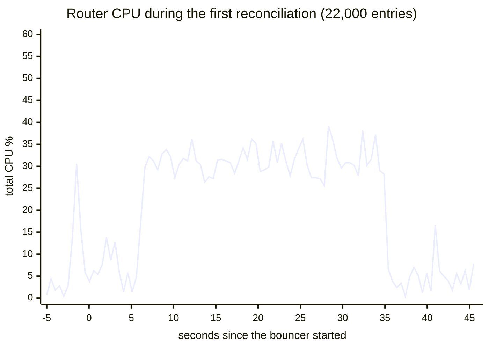
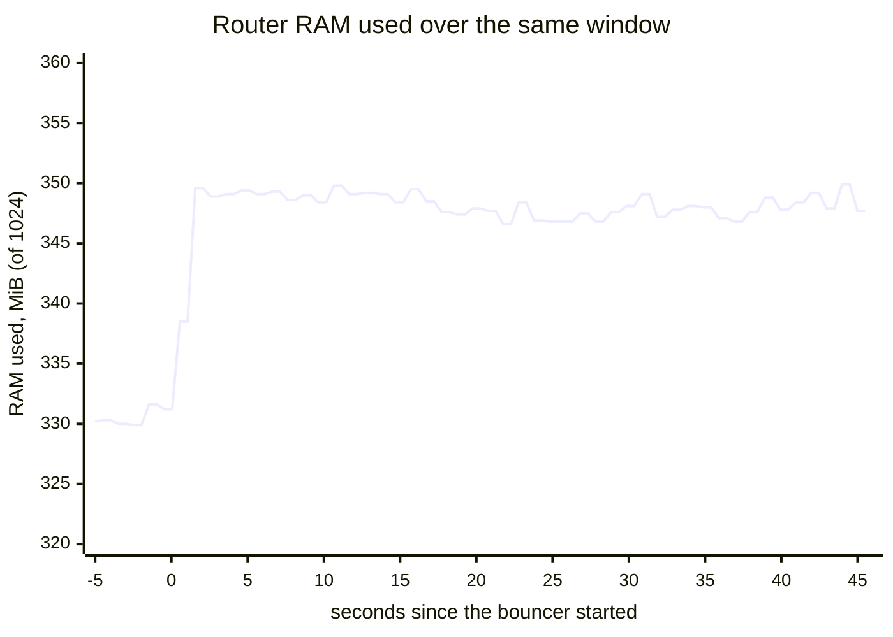

The benchmark command measures RouterOS API operations against a real router. It is intended for development and capacity planning, not for normal deployments.

## Command

Build and run the benchmark:

```bash
go run ./cmd/benchmark
```

The config path is optional and defaults to `config/test.yaml`:

```bash
go run ./cmd/benchmark config/test.yaml
```

The benchmark reads the MikroTik section from the selected YAML file, connects to RouterOS, then runs API-level operations.

## What it measures

- Single IPv4 and IPv6 address-list adds/removes.
- Address-list find and list calls.
- Firewall rule create, find, and remove calls.
- Sequential IPv4 batch add/list/find/remove timings.

The benchmark uses documentation-prefix test addresses such as `198.51.100.0/24` and `2001:db8::/32`, but it still writes to the configured RouterOS address lists and firewall menus.

:::caution
Run benchmarks on a lab router or during a maintenance window. The command creates temporary firewall rules and address-list entries and then removes them.
:::

## Example output

```text
Connected to: lab-router

=== SINGLE OPERATION BENCHMARKS (RouterOS API) ===
  Add single IPv4                         35ms  OK
  Find IPv4 (1 entry)                     12ms  OK
  Remove IPv4 by .id                      18ms  OK

=== BATCH ADD BENCHMARKS (sequential via API) ===
  Add 100 IPv4 (sequential)                4s  (40ms/ip, failures=0)
```

Use the numbers to compare RouterOS versions, hardware models, TLS vs plaintext API, and network latency.

For real bouncer startup performance, prefer the functional CAPI tests because reconciliation uses script-based bulk adds and pool-based removals, not only sequential API calls.

## Real-world results

These figures come from the functional CAPI test suite (`tests/functional/`) run against a MikroTik RB5009, not from the single-operation `cmd/benchmark` tool above. See [Architecture: Connection pool](/cs-routeros-bouncer/architecture/#connection-pool) and [Script-based bulk add](/cs-routeros-bouncer/architecture/#script-based-bulk-add) for the mechanisms behind these numbers.

| Scenario                                                       | Result                        |
| -------------------------------------------------------------- | ----------------------------- |
| Cache-first optimistic add (address not yet on the router)     | ~1–3 ms per operation         |
| Check-first add (list entries before adding, avoided by cache) | ~400 ms per IP                |
| Script-based bulk add vs. sequential API calls                 | ~97× faster for large batches |
| Full RB5009 bulk-add, ~22,000 CAPI-origin entries              | ~29 s bulk, ~34 s from start  |

The gap between cache-first (~1-3 ms) and check-first (~400 ms) is why the in-memory address cache described in [Architecture](/cs-routeros-bouncer/architecture/#in-memory-address-cache) exists: it lets the bouncer skip the RouterOS list-then-add round trip for addresses it already knows about.

For CAPI-scale deployments (tens of thousands of entries), also see [CAPI Blocklists](/cs-routeros-bouncer/configuration/capi-blocklists/) and [Performance Tuning](/cs-routeros-bouncer/configuration/performance-tuning/) for `pool_size` sizing guidance.

## The full lifecycle, sampled every 100 ms

The chart below is a single continuous 51-second capture from the production
RB5009, taken with a 10 Hz sampler reading `/proc/stat` on the router itself
(see the note on method at the end of this page). It covers the three states an
operator actually meets: the router idle with the bouncer stopped and the
address list empty, the **first reconciliation** importing ~22,000 entries, and
the quiet state that follows with the full list in place. Each point is the
mean of five 100 ms samples; the sub-second peaks reach 57% for single 100 ms
slices during the import.



The import is the plateau: roughly 31% sustained for ~26 seconds, spread across
all four cores with the connection pool rotating single-core peaks of 50–100%.
Before it, the idle baseline; after it, back to ~5% with 22,000 entries loaded
— holding the list costs nothing, only reading and writing it does.



RAM is the quiet part of the story, with one surprise in the timing: the
~19 MiB step lands at connection time, before a single entry is imported —
and 22,000 entries later it has not moved again. Holding the list costs the
router almost nothing; memory is not where this workload bites, CPU during
list reads is. The idle stretch also shows the router's own background blips
— a real device is never a flat line.

### Method note

The 100 ms series comes from a sampler container running on the router itself,
reading the shared kernel's `/proc/stat` and `/proc/meminfo` at 10 Hz and
pushing batches straight to Loki — RouterOS's own `cpu-load` updates only once
per second, so scripts cannot see below that. The capture protocol: stop the
bouncer, delete both address lists, let the router settle, then start the
bouncer and record through the first reconciliation into steady state.

## Safety checklist

- Confirm the target is a lab router.
- Use dedicated test address lists when possible.
- Keep `command_timeout` high enough for slow devices.
- Check the router after interruption and remove any `benchmark-*` comments if a run is stopped midway.
