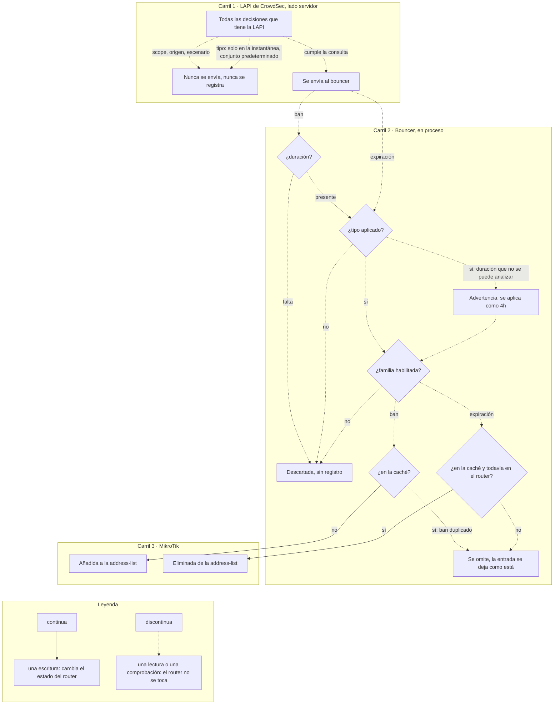

import { Steps, LinkCard } from "@astrojs/starlight/components";

Cómo procesa el bouncer las decisiones entrantes de CrowdSec.

## Flujo de procesamiento

Una decisión puede descartarse en dos sitios: en la **Local API**, que nunca envía lo que la consulta del bouncer excluye, y en el **propio bouncer**, que comprueba unas pocas cosas antes de tocar RouterOS. No hay una tercera etapa: ni una cadena de filtros dentro del bouncer, ni una política por decisión. La consulta tampoco es la misma en los dos caminos: el stream en vivo lleva los filtros de scope, origen y escenario, y la instantánea de reconciliación añade un cuarto, `type=ban`, mientras el conjunto de tipos aplicados se deje con su valor por defecto. Todo lo que sobrevive a los dos carriles acaba en una address-list, y nada más lo hace.



Dos detalles que los carriles aplanan. La exigencia de duración vale para los bans y para toda decisión de una instantánea de reconciliación, pero no para las expiraciones, que llegan sin ella con normalidad. Y el carril de expiración esconde una lectura: primero se consulta la caché y solo si la dirección está en ella el bouncer busca la entrada en el router, que es donde queda fuera una entrada que mientras tanto expiró en MikroTik.

<Steps>

1. **Recibir la decisión de la LAPI**

   El bouncer obtiene las decisiones nuevas y expiradas de la Local API de CrowdSec.

2. **Filtrado en la LAPI**

   `scopes`, `origins`, `scenarios_containing` y `scenarios_not_containing` no son comprobaciones locales: el bouncer los envía como parámetros de consulta en la petición a la LAPI, de modo que CrowdSec solo devuelve las decisiones que ya cumplen esos filtros. Las decisiones rechazadas por estos filtros nunca llegan al bouncer, así que ningún registro local las refleja.

   | Parámetro de consulta      | Clave de configuración              | Valor por defecto          |
   | -------------------------- | ----------------------------------- | -------------------------- |
   | `scopes`                   | `crowdsec.scopes`                   | `["ip", "range"]`          |
   | `origins`                  | `crowdsec.origins`                  | vacío — todos los orígenes |
   | `scenarios_containing`     | `crowdsec.scenarios_containing`     | vacío — sin restricción    |
   | `scenarios_not_containing` | `crowdsec.scenarios_not_containing` | vacío — no se excluye nada |

   La instantánea periódica de reconciliación envía uno más: `type=ban`, y solo mientras `crowdsec.supported_decisions_types` se deje con su valor por defecto. La Local API compara ese parámetro de forma exacta y no como conjunto, así que un conjunto configurado más amplio hay que traerlo entero y acotarlo en el bouncer. El stream en vivo no lleva ningún filtro de tipo, y por eso la comprobación de tipo de más abajo es del propio bouncer.

3. **Analizar la decisión**

   El bouncer solo conserva los tipos de decisión que está configurado para aplicar —`ban` salvo que `crowdsec.supported_decisions_types` nombre otros— y cualquier otro tipo se descarta en silencio. Las decisiones nuevas que no traen duración también se descartan. Una duración que no se puede analizar se registra como advertencia (`failed to parse decision duration`) y se recurre a 4h. Cada decisión que supera el análisis **en el stream en vivo** se registra a nivel debug como `new decision` o `deleted decision`. La instantánea periódica de reconciliación analiza las decisiones igual, pero no registra nada por decisión.

4. **Aplicar la acción**
   - **Ban** → Añadir la IP/rango a la address-list de MikroTik
   - **Unban** → Eliminar la IP/rango de la address-list

   Las decisiones de un protocolo desactivado (`firewall.ipv4.enabled` o `firewall.ipv6.enabled` a `false`) se omiten sin dejar registro. Un ban cuya dirección ya está en la caché en memoria se omite con un registro de nivel debug.

</Steps>

## Filtrado por origen

Cuando `origins` está configurado, la LAPI solo envía al bouncer las decisiones de los orígenes especificados:

| Origen     | Fuente                                                |
| ---------- | ----------------------------------------------------- |
| `crowdsec` | Detecciones del motor local de CrowdSec               |
| `cscli`    | Bans manuales mediante `cscli decisions add`          |
| `CAPI`     | Blocklists comunitarias de la Central API de CrowdSec |
| `lists`    | Suscripciones a blocklists de terceros                |

```yaml
crowdsec:
  origins: ["crowdsec", "cscli"] # Ignorar las listas comunitarias de CAPI
```

Cuando `origins` está vacío (valor por defecto), **se aceptan todos los orígenes**.

## Filtrado por escenario

Los filtros de escenario usan los campos `scenarios_containing` y `scenarios_not_containing` de CrowdSec. Buscan subcadenas literales en el nombre del escenario, como `ssh`, `http` o `crowdsecurity/ssh-bf`.

```yaml
crowdsec:
  scenarios_containing:
    - "ssh"
    - "http"
  scenarios_not_containing:
    - "test"
```

Usa `scenarios_containing` para quedarte solo con los escenarios que coinciden. Usa `scenarios_not_containing` para excluir escenarios ruidosos o no deseados. Ambos filtros viajan con la petición a la LAPI, así que CrowdSec los aplica antes de enviar nada al bouncer.

## Gestión de IPs duplicadas

Cuando la misma IP aparece en varias decisiones (por ejemplo, con distintos escenarios u orígenes), el bouncer lo gestiona de forma eficiente:

1. **Durante los bans**: consulta primero la caché en memoria. Si ya se sabe que la dirección está presente, la llamada a la API de RouterOS se omite.
2. **Durante los unbans**: consulta primero la caché en memoria y solo elimina de MikroTik si la IP está realmente presente
3. **Al arrancar y en la reconciliación periódica**: el recolector de decisiones deduplica las IPs antes de la reconciliación
4. **Tras fallos de caché**: si RouterOS aun así responde con `already have such entry`, el bouncer lo trata como un conflicto a nivel de dispositivo, mantiene la sesión de API abierta, localiza la entrada existente, actualiza su timeout/comentario y registra la dirección en la caché. Esta ruta de escritura solo ocurre cuando la dirección faltaba en la caché local.

:::note
La gestión de duplicados es transparente: la address-list solo contiene una entrada por IP, con independencia de cuántas decisiones la referencien. Los eventos de ban duplicados ya en caché no refrescan el timeout de RouterOS durante la misma ejecución; esto evita escrituras repetidas en RouterOS durante los picos del stream. La reconciliación periódica repara la deriva real volviendo a añadir las direcciones que siguen activas en CrowdSec pero faltan en MikroTik.
:::

<LinkCard
  title="Configuración de CrowdSec"
  description="Configura los orígenes, los filtros de subcadena de escenarios y los ajustes de conexión a la LAPI."
  href="/cs-routeros-bouncer/es/configuration/crowdsec/"
/>
