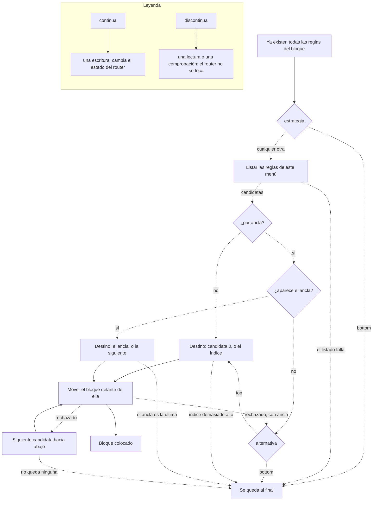

import { Steps, LinkCard } from "@astrojs/starlight/components";
import RuleSet from "../../../../components/RuleSet.astro";

Cómo crea y gestiona el bouncer las reglas del [firewall de RouterOS](https://help.mikrotik.com/docs/spaces/ROS/pages/250708066/Firewall).

## Reglas que escribe el daemon

El bouncer no escribe una regla por tabla. Escribe un **bloque** ordenado por chain, y escribe ese bloque una vez por cada familia de protocolo habilitada: `firewall.ipv4.enabled` y `firewall.ipv6.enabled` valen `true` por defecto, así que la configuración de partida construye dos veces cada regla de aquí abajo, contra `crowdsec-banned` para IPv4 y contra `crowdsec6-banned` para IPv6. También se construye un bloque por cada entrada de `firewall.filter.chains` y `firewall.raw.chains`; añade una chain ahí y el bloque completo se repite en ella.

Dentro de un bloque el orden es fijo —whitelist, contador, denegación— y el bloque solo se mueve a su posición cuando ya existen todas sus reglas, de modo que RouterOS nunca evalúa un bloque a medio construir.

### Se crean por defecto

<RuleSet scope="default" count />

Las dos reglas `passthrough` de contador son las que ninguna versión anterior de esta página listaba, y son la razón de que un router con la configuración de partida muestre ocho reglas del bouncer donde la documentación describía cuatro. Las crea `metrics.track_processed`, cuyo valor predeterminado es `true`.

Una regla de contador no coincide con ninguna address-list, no lleva `src-address-list` y no toma ninguna decisión: `passthrough` en RouterOS se limita a incrementar los contadores de bytes y paquetes de la regla y seguir adelante. Es intencionado: el bouncer lee esos contadores para informar de cuánto tráfico han _evaluado_ sus chains, que es el denominador de cuánto se ha descartado. Y también es la razón de que, revisando el router a simple vista, la regla parezca exactamente una regla suelta que alguien olvidó. No lo es.

`metrics.track_processed` se consulta por su cuenta, no por detrás de `metrics.enabled`, cuyo valor predeterminado es `false`. Un router cuyo bouncer no expone ningún endpoint de métricas sigue llevando las dos reglas de contador, contando en silencio para nadie. Establecer `metrics.track_processed: false` las elimina y, con ellas, las métricas `crowdsec_bouncer_processed_*`; los contadores de descartes, que salen de las propias reglas de denegación, no se ven afectados.

### Solo se crean si una opción las pide

<RuleSet scope="conditional" />

## Flujo de creación de reglas

Al arrancar, el bouncer sigue esta secuencia:

<Steps>

1. **Comprobar si existen reglas**

   Busca reglas gestionadas por el bouncer comparando el patrón del comentario.

2. **Reutilizar o crear**

   Una regla cuyo comentario exacto ya está en el router se adopta, no se duplica; lo que falte se crea.

3. **Colocar el bloque en la posición configurada**

   Coloca el bloque gestionado según el `rule_placement` efectivo para ese protocolo y tabla: arriba, abajo, una posición numérica de RouterOS o un comentario ancla.

</Steps>

## Colocación de reglas

El bouncer coloca las reglas relacionadas como bloques ordenados. Un bloque de input típico incluye las siguientes reglas en orden: `whitelist` (si está configurada), `counting` (si las métricas de procesados están habilitadas) y después la regla de deny/reject. La colocación se realiza cuando ya existen todas las reglas del bloque, de modo que el orden interno se mantiene estable.

La colocación es local a cada menú. Un bloque de `filter` se posiciona dentro de `/ip firewall filter` o `/ipv6 firewall filter`; un bloque de `raw` se posiciona dentro de `/ip firewall raw` o `/ipv6 firewall raw`.

El bouncer puede colocar su bloque gestionado (las reglas relacionadas que crea y mueve juntas) arriba, abajo, en una posición numérica de `print` de RouterOS, o relativa a un comentario existente perteneciente a otra regla. Si el bloqueo de salida está habilitado, el bloque de output se mueve con el mismo orden interno. Por defecto, el bouncer reutiliza la misma estrategia de colocación para IPv4 e IPv6. Las anulaciones por tabla y por protocolo pueden enviar los bloques de `filter`, `raw`, IPv4 e IPv6 a ubicaciones distintas. La precedencia es: colocación global, anulación global de tabla, anulación de protocolo y, por último, anulación de tabla del protocolo.

La colocación se calcula sobre los **candidatos**: todas las reglas que ya están en ese menú y cuyo comentario no lleva la firma `@cs-routeros-bouncer`. Las reglas del propio bouncer quedan fuera de esa cuenta, así que una `position` numérica significa el mismo lugar esté o no el bloque ya en el router. El diagrama siguiente es el mecanismo completo, reintentos incluidos: cada peldaño que falla cae al siguiente, y el último peldaño siempre es _dejar el bloque donde RouterOS lo añadió_. La colocación nunca aborta el arranque.



Dos peldaños merecen una segunda lectura. El reintento es por candidata, no por intento: cuando RouterOS rechaza mover el bloque delante de una regla —una regla dinámica o integrada, por ejemplo— el bouncer apunta a la regla siguiente y vuelve a intentarlo, y por eso un bloque `top` puede acabar unas posiciones más abajo de lo que su nombre sugiere. Y `fallback` solo existe para las estrategias por comentario: una `position` numérica más allá del final no tiene ancla que fallar, así que simplemente se añade al final.

El movimiento tampoco es atómico para todo el bloque. Cada regla se mueve por separado, en el orden del bloque, así que un fallo a mitad de camino puede dejar el bloque partido alrededor del destino; el orden lo completa la siguiente pasada de colocación.

| Estrategia       | Comportamiento                                                                                                                                                                                                    |
| ---------------- | ----------------------------------------------------------------------------------------------------------------------------------------------------------------------------------------------------------------- |
| `top`            | Mueve el bloque antes de la primera regla utilizable que no sea del bouncer. Si RouterOS rechaza la posición, por ejemplo antes de reglas dinámicas o integradas, el bouncer reintenta con posiciones inferiores. |
| `bottom`         | Deja las reglas recién creadas añadidas al final.                                                                                                                                                                 |
| `position`       | Requiere `position` y usa la numeración de `print` de RouterOS empezando en cero, excluyendo las reglas existentes del bouncer. Las posiciones fuera de rango se añaden al final.                                 |
| `before_comment` | Mueve el bloque antes de la primera regla no perteneciente al bouncer cuyo comentario coincide con el ancla configurada.                                                                                          |
| `after_comment`  | Mueve el bloque después del ancla coincidente insertándolo antes de la siguiente regla no perteneciente al bouncer; si el ancla es la última, el bloque se queda añadido al final.                                |

La colocación por comentario usa `fallback` (`top` por defecto, o `bottom`) cuando el ancla no existe o no puede usarse. La `position` numérica ignora `fallback` porque una posición fuera de rango implica de forma natural añadir al final.

## Identificación de reglas

Las reglas se identifican mediante un comentario estructurado:

```text
{prefix}:{type}-{chain}-{direction}-{protocol} @cs-routeros-bouncer
```

| Parte       | Valores                                                                  |
| ----------- | ------------------------------------------------------------------------ |
| `prefix`    | Configurable mediante `comment_prefix` (por defecto: `crowdsec-bouncer`) |
| `type`      | `filter` o `raw`                                                         |
| `chain`     | `input`, `forward`, `prerouting`, `output`                               |
| `direction` | `input`, `output`, `whitelist` o `counting`                              |
| `protocol`  | `v4` o `v6`                                                              |

RouterOS imprime el comentario encima de la regla a la que pertenece, así que el bloque gestionado completo se ve con una sola consulta:

```routeros
/ip/firewall/filter print where comment~"crowdsec"
# 0  ;;; crowdsec-bouncer:filter-input-counting-v4 @cs-routeros-bouncer
#       chain=input action=passthrough
# 1  ;;; crowdsec-bouncer:filter-input-input-v4 @cs-routeros-bouncer
#       chain=input action=drop src-address-list=crowdsec-banned
```

:::note
El sufijo `@cs-routeros-bouncer` se añade siempre y sirve para distinguir las reglas creadas por este bouncer de otras reglas que casualmente puedan tener comentarios similares. No es configurable, y eso es lo que permite recuperarse de una caída incluso después de haber cambiado `comment_prefix`.
:::

## Limpieza y lo que queda atrás

Cuando el bouncer recibe SIGTERM o SIGINT:

<Steps>

1. **Eliminar las reglas**

   Se elimina toda regla de firewall creada por el bouncer, incluidas las de contador.

2. **No tocar las address-lists**

   Las entradas de las address-lists **no** se eliminan. Expiran mediante el timeout de MikroTik con el que se escribieron, que es la duración de la decisión de CrowdSec que las creó.

</Steps>

Este diseño implica que la protección continúa después de detener el bouncer, durante lo que le quede de timeout a cada entrada, y que un reinicio rápido nunca deja el router desprotegido en ese intervalo. También implica que no hay que ejecutar ningún borrado masivo al apagar.

:::caution
Una decisión cuya duración resuelve a cero o menos se escribe **sin timeout alguno** —CrowdSec sí emite duraciones restantes negativas—. (Una decisión que no trae campo de duración se descarta en `parseDecisionBatch` y nunca llega al router.) Esa entrada no expira: permanece en la address-list hasta que la siguiente reconciliación la retire, o hasta que la elimines a mano. Las reglas desaparecen con el daemon; esas entradas no.
:::

<LinkCard
  title="Configuración del firewall"
  description="Configura los tipos de reglas, la colocación, el registro y personalizaciones avanzadas."
  href="/cs-routeros-bouncer/es/configuration/firewall/"
/>
