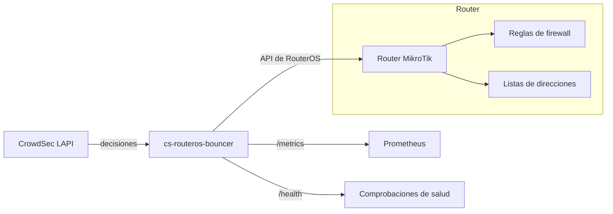
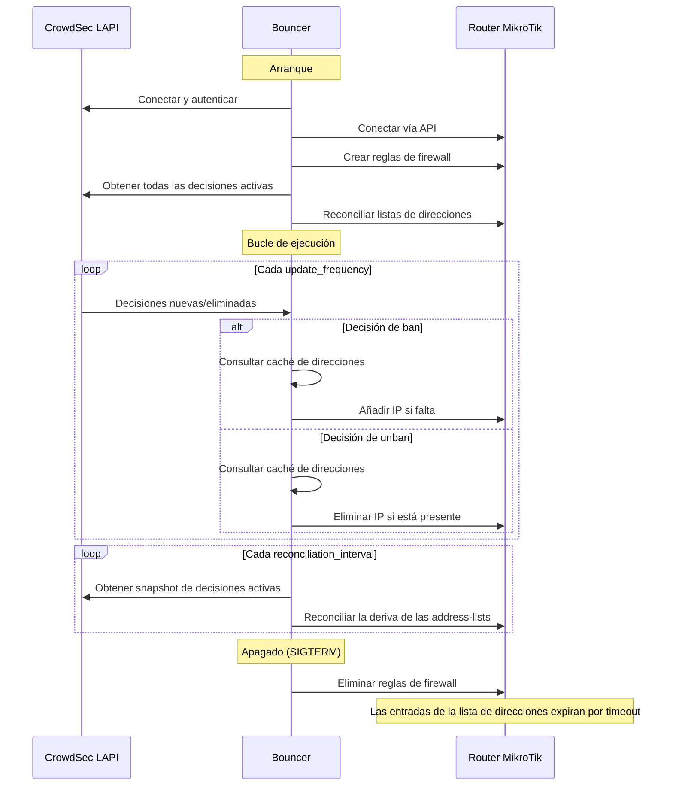

import { LinkCard, CardGrid } from "@astrojs/starlight/components";

cs-routeros-bouncer actúa como puente entre la inteligencia de amenazas de CrowdSec y el firewall de MikroTik.

## Visión general



## Temas en profundidad

<CardGrid>
  <LinkCard
    title="Reglas de firewall"
    description="Cómo se crean, identifican, colocan y limpian las reglas."
    href="/cs-routeros-bouncer/es/architecture/firewall-rules/"
  />
  <LinkCard
    title="Procesamiento de decisiones"
    description="Cómo se filtran y aplican las decisiones de CrowdSec."
    href="/cs-routeros-bouncer/es/architecture/decisions/"
  />
  <LinkCard
    title="Reconciliación"
    description="Sincronización al arrancar y gestión de address-lists basada en diferencias."
    href="/cs-routeros-bouncer/es/architecture/reconciliation/"
  />
</CardGrid>

## Componentes

El bouncer está compuesto por varios paquetes internos:

| Paquete                   | Responsabilidad                                                         |
| ------------------------- | ----------------------------------------------------------------------- |
| `cmd/cs-routeros-bouncer` | Punto de entrada de la CLI, enrutamiento de subcomandos                 |
| `internal/config`         | Carga de configuración, validación, vinculación de variables de entorno |
| `internal/crowdsec`       | Cliente de streaming de la LAPI de CrowdSec                             |
| `internal/routeros`       | Cliente de la API de RouterOS (direcciones, reglas de firewall)         |
| `internal/manager`        | Orquestador central: conecta todas las piezas                           |
| `internal/metrics`        | Métricas de Prometheus y endpoint de salud                              |

## Flujo de datos



## Principios de diseño

### Identificación basada en comentarios

Todos los recursos creados por el bouncer en MikroTik se etiquetan con un comentario estructurado:

```text
{comment_prefix}:{type}-{chain}-{direction}-{protocol} @cs-routeros-bouncer
```

Ejemplos:

- `crowdsec-bouncer:filter-input-input-v4 @cs-routeros-bouncer`
- `crowdsec-bouncer:raw-prerouting-input-v6 @cs-routeros-bouncer`

Esto permite al bouncer identificar y gestionar con precisión sus propios recursos sin afectar a las reglas creadas por el usuario.

### Adición optimista con caché primero

Al procesar una decisión de ban, el bouncer consulta primero su caché de direcciones en memoria:

1. Si la dirección ya está en la caché, la llamada a la API de RouterOS se omite por completo.
2. Si la dirección no está en la caché, intenta añadirla directamente (~1–3 ms).
3. Si RouterOS devuelve `already have such entry`, lo trata como un conflicto a nivel de dispositivo, mantiene la conexión abierta, localiza la entrada existente y actualiza su timeout/comentario.

Esto es significativamente más rápido que el enfoque de "comprobar primero" (~400 ms por IP), que exigiría listar antes todas las entradas.

### Pool de conexiones

El bouncer mantiene un pool configurable de conexiones persistentes a la API de RouterOS. Durante la reconciliación, el trabajo se distribuye por el pool mediante el helper genérico `ParallelExec`; en un RB5009 con `pool_size: 10`, el trabajo completo de adición masiva en RouterOS para ~28.700 entradas de origen CAPI se completó en ~35–36 s.

### Adición masiva basada en scripts

Para la reconciliación inicial, el bouncer genera scripts de RouterOS que añaden entradas en bloques de 100 IPs por script. Cada entrada usa `:do { ... } on-error={}` para omitir los duplicados de forma controlada. Este enfoque es ~97× más rápido que las llamadas individuales secuenciales a la API para listas grandes.

### Caché de direcciones en memoria

Un mapa en memoria (`map[string]struct{}` con `sync.RWMutex`) registra todas las direcciones presentes actualmente en el router. Esto proporciona:

- **Búsquedas de unban en O(1)**: cuando se levanta el ban de una IP, primero se consulta la caché. Si la IP no está en la caché (por ejemplo, ya expiró en el router), la llamada a la API se omite por completo.
- **Ruta rápida en O(1) para bans duplicados**: los eventos de ban repetidos para direcciones que ya se sabe que están en el router se resuelven de inmediato sin generar tráfico innecesario de gestión/API en RouterOS.
- **Prefiltrado durante el arranque**: las eliminaciones recibidas durante la recogida inicial de decisiones se prefiltran contra los bans entrantes para evitar trabajo innecesario.

### Listas de direcciones con nombre único

A diferencia de algunos bouncers que crean listas con marca de tiempo, cs-routeros-bouncer usa una única address-list con nombre por protocolo:

- `crowdsec-banned` para IPv4
- `crowdsec6-banned` para IPv6

Las reglas de firewall referencian estas listas por nombre, lo que es más eficiente y evita el problema de la duplicación.

### Reconciliación basada en diferencias

Al arrancar, y después periódicamente según `crowdsec.reconciliation_interval`, el bouncer calcula la diferencia entre las decisiones activas de CrowdSec y el estado actual de la address-list de MikroTik:

1. Obtener todas las decisiones activas de CrowdSec
2. Obtener todas las entradas de la address-list de MikroTik
3. Comparar ambos conjuntos
4. Añadir las entradas que faltan (están en CrowdSec pero no en MikroTik)
5. Eliminar las entradas obsoletas (están en MikroTik pero no en CrowdSec)

Esto mantiene la pertenencia sincronizada con independencia de cómo se detuvo el bouncer, de lo que ocurriera mientras estaba fuera de línea o de si las entradas del lado de RouterOS expiraron mientras CrowdSec aún las consideraba activas.
