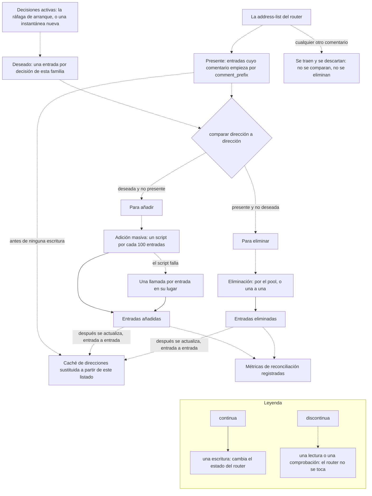

import { Steps, LinkCard, CardGrid } from "@astrojs/starlight/components";

Cómo mantiene el bouncer la pertenencia a las address-lists de MikroTik sincronizada con las decisiones de CrowdSec.

## El problema de la reconciliación

Cuando el bouncer arranca (o se reinicia), o durante el intervalo de reconciliación periódica, la address-list de MikroTik puede estar desincronizada con las decisiones activas de CrowdSec:

- Puede que se hayan añadido IPs a CrowdSec mientras el bouncer estaba fuera de línea
- Puede que haya IPs que expiraron en CrowdSec pero sigan en la lista de MikroTik
- Puede que haya IPs que expiraron o se eliminaron manualmente en MikroTik mientras seguían activas en CrowdSec
- Pueden seguir existiendo entradas del bouncer de una ejecución anterior

Por defecto, la reconciliación se ejecuta al arrancar y después cada `15m`. Configura `crowdsec.reconciliation_interval` para cambiar esta cadencia. Establécelo a `0` para desactivar la reconciliación periódica; los valores por debajo de `1m` se rechazan al arrancar, así que usa `0` para desactivarla o una duración de `1m` o superior para activarla.

## Proceso de reconciliación

<Steps>

1. **Recopilar**

   Obtener todas las decisiones activas de CrowdSec y todas las entradas de la address-list de MikroTik.

2. **Comparar**

   Comparar ambos conjuntos para determinar qué IPs hay que añadir y cuáles eliminar.

3. **Refrescar la caché**

   Sustituir la caché de direcciones en memoria de esta familia por lo que el router acaba de comunicar, antes de que salga una sola adición o eliminación, para que los manejadores de ban y unban en vivo dejen de fiarse de entradas que el router ya no tiene.

4. **Aplicar**

   Ejecutar las adiciones (mediante scripts masivos, 100 IPs por lote) y las eliminaciones (llamadas paralelas a la API a través del pool de conexiones cuando este llegó a abrirse, y una a una por la conexión principal cuando no). Cada una de las dos actualiza la caché con lo que ha intentado escribir.

5. **Verificar**

   Registrar las métricas de reconciliación y los recuentos finales para confirmar que la pertenencia a la address-list coincide con CrowdSec.

</Steps>

La comparación se hace por familia de protocolo y por address-list. Entran dos conjuntos —lo que CrowdSec dice que debe estar bloqueado y lo que el router tiene ahora mismo— y salen dos listas.



El filtro por prefijo sobre el conjunto _presente_ es lo que hace seguro apuntar la reconciliación a una lista compartida. El bouncer pide a RouterOS la lista por su nombre y después se queda solo con las entradas cuyo comentario empieza por el `comment_prefix` configurado, así que una dirección que añadiste a mano —o que mantiene otra herramienta— ni siquiera entra en la comparación, y la rama de «presente y no deseada» no puede alcanzarla.

La comparación es por dirección normalizada, no por decisión: varias decisiones sobre la misma IP se colapsan en una sola entrada deseada, y solo la última leída aporta el timeout y el comentario con los que se escribe.

## Rendimiento

Medido en un MikroTik RB5009UG+S+ (ARM64, 4 núcleos @ 1400 MHz, 1 GB de RAM, RouterOS 7.22.1) con `mikrotik.pool_size: 10`:

| Métrica                               | CAPI completo (~28.700 IPs)                                          |
| ------------------------------------- | -------------------------------------------------------------------- |
| Reconciliación en frío (tiempo total) | ~58 s                                                                |
| Trabajo de adición masiva en RouterOS | ~35–36 s                                                             |
| Pico de CPU observado en el router    | ~39% durante grandes ráfagas de adición/eliminación                  |
| Comprobación periódica sin deriva     | ~3–4 s, sin escrituras de adición/eliminación                        |
| Eliminación masiva CAPI → solo local  | ~26.800 eliminaciones en ~77 s de trabajo de eliminación en RouterOS |

:::note[CPU del router]
Los picos de CPU del router son esperables durante la reconciliación, porque el bouncer está añadiendo o eliminando muchas entradas de la address-list. Tras la reconciliación, la CPU de RouterOS debería volver a niveles normales de inactividad/tráfico. Un uso alto sostenido de CPU suele indicar escrituras/reconexiones repetidas de la API o carga del router no relacionada, no el mero hecho de que las entradas de la address-list existan en memoria.
:::

La reconciliación periódica suele ser ligera: cuando no hay deriva, lista las entradas actuales de la address-list, las compara con el snapshot activo de CrowdSec, actualiza los contadores y no realiza escrituras de adición/eliminación.

## Optimizaciones

### Adición masiva basada en scripts

En lugar de llamadas individuales a la API (~97× más lentas), el bouncer sube un script temporal de RouterOS llamado `crowdsec-bulk-import` y lo ejecuta por su id interno:

```routeros
/system/script/run =number=<script-id>
```

Cada ejecución del script añade hasta 100 IPs usando `:do { ... } on-error={}` para gestionar los duplicados de forma controlada.

### Eliminación en paralelo

Las eliminaciones usan el pool de conexiones configurado con llamadas concurrentes a la API. En la prueba de CAPI con el RB5009, eliminar ~26.800 entradas exclusivas de CAPI llevó ~77 s de trabajo de eliminación en RouterOS.

### Prefiltrado

Durante la recogida inicial de decisiones, si se reciben un ban y su unban correspondiente para la misma IP, el unban prefiltra el ban y lo elimina del conjunto pendiente. Esto evita añadir y eliminar inmediatamente la misma IP.

:::tip
Si la reconciliación tarda demasiado, plantéate usar el filtrado por `origins` para limitar el número de decisiones sincronizadas. Los despliegues solo locales son mucho más pequeños que las blocklists completas de CAPI y provocan menos trabajo extra en arranques y reinicios.
:::

<CardGrid>
  <LinkCard
    title="Métricas de Prometheus"
    description="Métricas relacionadas con la reconciliación para la monitorización."
    href="/cs-routeros-bouncer/es/monitoring/prometheus/"
  />
  <LinkCard
    title="Panel de Grafana"
    description="Monitorización visual de la reconciliación."
    href="/cs-routeros-bouncer/es/monitoring/grafana/"
  />
</CardGrid>
