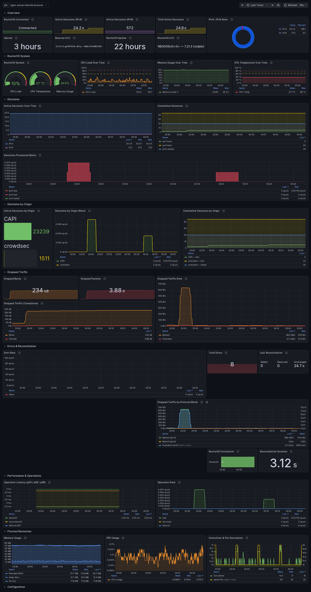
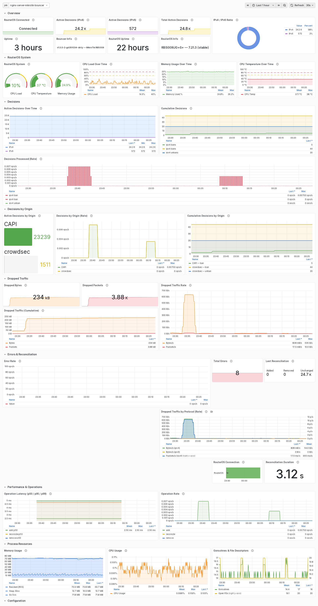

import { Steps, LinkCard, CardGrid } from '@astrojs/starlight/components';

A pre-built Grafana dashboard is included for monitoring the bouncer and router health.

## Screenshots

**Dark theme:**

**Light theme:**

## Installation

<Steps>

1. **Open Grafana import**

   Navigate to **Dashboards** → **New** → **Import**.

2. **Upload the dashboard JSON**

   Upload `grafana/cs-routeros-bouncer.json` from the repository.

3. **Select Prometheus data source**

   Choose the Prometheus data source where bouncer metrics are stored.

</Steps>

## Requirements

- Prometheus data source configured in Grafana
- Bouncer running with `metrics.enabled: true`
- Prometheus scraping the bouncer's `/metrics` endpoint

## Dashboard panels

| Panel | Description |
|-------|-------------|
| Active Decisions | Gauge showing total active bans |
| Active Decisions by Origin | Breakdown by origin (crowdsec, cscli, CAPI, lists) |
| Active Decisions by Scope | Breakdown by scope (IP, Range) |
| Decisions Processed | Time series of ban/unban operations over time |
| LAPI / RouterOS API Calls | API call rates and error rates |
| Stream Events | LAPI polling events and errors |
| LAPI Latency | Polling latency gauge |
| Reconciliation | Duration and success/failure counts |
| Router CPU | Per-core CPU load |
| Router Memory | Memory usage percentage |
| Router Temperature | System temperature |
| Configuration | Current bouncer configuration parameters |

:::tip
Use the time range selector to zoom into specific events. The "Decisions Processed" panel is useful for correlating ban spikes with specific incidents.
:::

## Related

<CardGrid>
  <LinkCard title="Prometheus Metrics" description="Full reference of all exported metrics" href="/cs-routeros-bouncer/monitoring/prometheus/" />
  <LinkCard title="Health Endpoint" description="HTTP health check for uptime monitoring" href="/cs-routeros-bouncer/monitoring/health/" />
</CardGrid>
